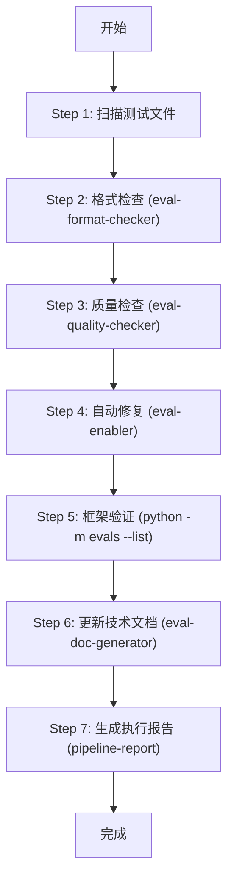

# Evals 流水线设计计划

## 目标

设计 `pipeline-evals` 流水线，实现从需求文档到测试用例格式定义再到框架实现的完整链路，包含格式检查和质量检查能力。

## 流水线输入/输出

### 输入
```
/pipeline docs/testing/Evals
/pipeline docs/testing/Evals/edge-cases/hermes-fico-boundary.md
```

### 输出
```
docs/testing/Evals/**/*.md          # 验证/修复后的测试用例
docs/design/Tech-design/evals-framework.md  # 更新的技术设计文档
docs/records/Pipeline-runs/*.md     # 执行报告
```

---

## 新建 Agents

### 1. `eval-format-checker` - 格式检查 Agent

**职责**：批量验证测试文档格式，输出机器可读的检查报告

**文件**：`.claude/agents/eval-format-checker.md`

```yaml
---
name: eval-format-checker
description: 批量验证评估测试文档格式。检查 frontmatter、测试用例结构、期望字段，输出 JSON 格式的检查报告。
model: haiku
---
```

**检查项**：
- [ ] YAML frontmatter 完整性（category, priority）
- [ ] 测试用例结构（## 测试用例:, **输入**:, **期望**:）
- [ ] 期望字段格式（包含、不包含、工具调用、审批等）
- [ ] Schema 字段有效性（对照 expectations.schema.yaml）

**输出格式**：
```json
{
  "files": [
    {
      "path": "docs/testing/Evals/edge-cases/hermes-fico-boundary.md",
      "status": "pass|fail|warn",
      "issues": [
        {"type": "error|warning", "line": 10, "message": "缺少 category 字段"}
      ]
    }
  ],
  "summary": {"total": 12, "pass": 10, "fail": 1, "warn": 1}
}
```

---

### 2. `eval-quality-checker` - 质量检查 Agent

**职责**：验证测试内容的质量和完整性

**文件**：`.claude/agents/eval-quality-checker.md`

```yaml
---
name: eval-quality-checker
description: 验证评估测试用例的质量。检查期望字段覆盖度、测试用例完整性、业务规则正确性。
model: sonnet
---
```

**检查项**：
- [ ] 期望覆盖度（是否有足够的验证点）
- [ ] 测试用例独立性（是否重复）
- [ ] 业务规则正确性（对照 Wiki 知识库）
- [ ] 边界覆盖（阈值边界是否测试）

**输出格式**：
```json
{
  "files": [
    {
      "path": "docs/testing/Evals/edge-cases/hermes-fico-boundary.md",
      "quality_score": 0.85,
      "issues": [
        {"type": "coverage", "message": "缺少 FICO 640 边界测试"},
        {"type": "redundancy", "message": "用例 3 和用例 7 重复"}
      ],
      "suggestions": ["添加 FICO 640 拒绝场景"]
    }
  ]
}
```

---

### 3. `eval-doc-generator` - 技术文档生成 Agent

**职责**：生成/更新 `evals-framework.md` 技术设计文档

**文件**：`.claude/agents/eval-doc-generator.md`

```yaml
---
name: eval-doc-generator
description: 生成或更新 Evals 框架技术设计文档。从 Schema 和代码自动提取架构、字段映射、使用示例。
model: haiku
---
```

**输出**：`docs/design/Tech-design/evals-framework.md`

**内容自动同步**：
- 从 `evals/schema/expectations.schema.yaml` 提取字段映射表
- 从 `evals/` 目录结构生成架构图
- 从 `evals/__main__.py` 提取 CLI 命令

---

## 更新 Skill

### `pipeline-evals` Skill 完整重写

**文件**：`.claude/skills/pipeline-evals/SKILL.md`

```yaml
---
name: pipeline-evals
description: Evals 测试流水线。格式检查 → 质量检查 → 自动修复 → 技术文档更新 → 报告生成。
allowed-tools: Read, Write, Bash, Task, Glob, Grep, Edit
---
```

### 执行流程



### 详细步骤

| Step | 操作 | 调用组件 | 输出 |
|------|------|---------|------|
| 1 | 扫描测试文件 | Glob | 文件列表 |
| 2 | 格式检查 | `eval-format-checker` | format-report.json |
| 3 | 质量检查 | `eval-quality-checker` | quality-report.json |
| 4 | 自动修复 | `eval-enabler` | 修复后的 .md 文件 |
| 5 | 框架验证 | `python -m evals --list` | 加载验证 |
| 6 | 更新技术文档 | `eval-doc-generator` | evals-framework.md |
| 7 | 生成报告 | `pipeline-report` | Pipeline-runs/*.md |

---

## 文件清单

### 需要创建

| 路径 | 类型 | 说明 |
|------|------|------|
| `.claude/agents/eval-format-checker.md` | Agent | 格式检查 |
| `.claude/agents/eval-quality-checker.md` | Agent | 质量检查 |
| `.claude/agents/eval-doc-generator.md` | Agent | 文档生成 |

### 需要修改

| 路径 | 类型 | 修改内容 |
|------|------|----------|
| `.claude/skills/pipeline-evals/SKILL.md` | Skill | 完整重写，增加检查和文档生成步骤 |
| `.claude/commands/pipeline.md` | Command | 添加 evals 路由规则说明 |

### 关键参考文件

| 路径 | 说明 |
|------|------|
| `evals/schema/expectations.schema.yaml` | 期望字段定义（SSOT） |
| `evals/core/parser.py` | Markdown 解析器 |
| `docs/testing/Evals/edge-cases/*.md` | 现有测试用例示例 |
| `docs/design/Tech-design/evals-framework.md` | 现有技术文档 |

---

## 实现顺序

1. **创建 `eval-format-checker.md`** - 格式检查 Agent
2. **创建 `eval-quality-checker.md`** - 质量检查 Agent
3. **创建 `eval-doc-generator.md`** - 文档生成 Agent
4. **重写 `pipeline-evals/SKILL.md`** - 完整流程
5. **更新 `pipeline.md`** - 路由规则

---

## 与现有组件的关系

```
pipeline.md (入口)
    │
    ├─→ 检测路径 docs/testing/Evals/
    │
    └─→ pipeline-evals (Skill)
            │
            ├─→ eval-format-checker (Agent) - 格式检查
            ├─→ eval-quality-checker (Agent) - 质量检查
            ├─→ eval-enabler (Agent) - 自动修复 [现有]
            ├─→ eval-doc-generator (Agent) - 文档生成
            └─→ pipeline-report (Agent) - 报告生成 [现有]
```
