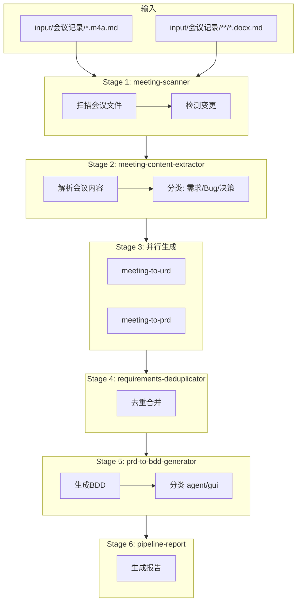

# 会议记录到需求文档和BDD流水线设计

## 概述

设计一个从会议记录自动生成 URD、PRD 和 BDD 文档的流水线 (`meeting-to-requirements-pipeline`)。

## 流水线架构



## 阶段定义

| 阶段 | Agent | 职责 | 模型 |
|------|-------|------|------|
| 1 | `meeting-scanner` | 扫描会议文件，检测变更 | haiku |
| 2 | `meeting-content-extractor` | 提取并分类会议内容 | sonnet |
| 3a | `meeting-to-urd` | 生成 URD 文档 | sonnet |
| 3b | `meeting-to-prd` | 生成/更新 PRD 文档 | sonnet |
| 4 | `requirements-deduplicator` | 去重合并需求 | sonnet |
| 5 | `prd-to-bdd-generator` | 从 PRD 生成 BDD | sonnet |
| 6 | `pipeline-report` | 生成执行报告 | haiku |

## 需要创建的文件

### 1. Skill 定义
- **文件**: `.claude/skills/meeting-to-requirements-pipeline/SKILL.md`
- **内容**: 流水线定义、阶段编排、数据交接规范

### 2. 新建 Agent（5个）

| Agent | 文件 |
|-------|------|
| `meeting-scanner` | `.claude/agents/meeting-scanner.md` |
| `meeting-content-extractor` | `.claude/agents/meeting-content-extractor.md` |
| `meeting-to-urd` | `.claude/agents/meeting-to-urd.md` |
| `meeting-to-prd` | `.claude/agents/meeting-to-prd.md` |
| `requirements-deduplicator` | `.claude/agents/requirements-deduplicator.md` |

### 3. 复用/修改 Agent（2个）

| Agent | 修改内容 |
|-------|----------|
| `prd-to-bdd-generator` | 添加 agent/gui 自动分类逻辑 |
| `pipeline-report` | 添加会议流水线报告模板 |

## 数据交接格式

### Stage 1 输出: `meeting-manifest.yaml`
```yaml
meetings:
  - path: input/会议记录/xxx.md
    hash: abc123
    status: new|changed|unchanged
summary:
  total: 2
  new: 1
  changed: 1
```

### Stage 2 输出: `extraction-result.yaml`
```yaml
extracted_items:
  - id: item-001
    type: requirement|bug|discussion|decision
    category: feature|enhancement|optimization
    title: "..."
    priority: P0|P1|P2
    related_modules: [...]
```

### Stage 3a 输出: `urd-generation.yaml`
```yaml
generated:
  - id: URD-009
    file: docs/requirements/URD/URD-009-xxx.md
    status: created|updated|skipped
```

### Stage 3b 输出: `prd-generation.yaml`
```yaml
actions:
  - file: docs/requirements/PRD/xxx.md
    action: created|updated
    linked_urd: [URD-009]
```

### Stage 5 输出: `bdd-generation.yaml`
```yaml
generated:
  - file: docs/testing/BDD/agent/xxx.feature
    classification: agent|gui
    scenarios: 8
```

## BDD 分类规则

| 类型 | 关键词 |
|------|--------|
| GUI | 输入框、按钮、界面、显示、点击、页面、跳转 |
| Agent | 对话、AI、回复、理解、判断、计算、评估、推荐 |

## 输入输出目录

| 类型 | 路径 |
|------|------|
| 输入 | `input/会议记录/` |
| URD | `docs/requirements/URD/` |
| PRD | `docs/requirements/PRD/` |
| BDD Agent | `docs/testing/BDD/agent/` |
| BDD GUI | `docs/testing/BDD/gui/` |
| 执行记录 | `docs/records/Pipeline-runs/YYYYMMDD-HHMMSS-meeting/` |

## 实现步骤

1. **创建 Skill 定义文件**
   - `.claude/skills/meeting-to-requirements-pipeline/SKILL.md`

2. **创建 5 个新 Agent**
   - meeting-scanner
   - meeting-content-extractor
   - meeting-to-urd
   - meeting-to-prd
   - requirements-deduplicator

3. **修改现有 Agent**
   - 更新 `prd-to-bdd-generator` 添加分类逻辑
   - 更新 `pipeline-report` 添加会议报告模板

## 参考文件

- `.claude/skills/evals-generate-pipeline/SKILL.md` - 流水线设计模式
- `.claude/agents/meeting-analyzer.md` - 现有会议分析逻辑
- `.claude/agents/prd-to-bdd-generator.md` - BDD 生成逻辑
- `docs/requirements/URD/URD-002-*.md` - URD 格式参考
- `docs/testing/BDD/agent/*.feature` - BDD 格式参考
