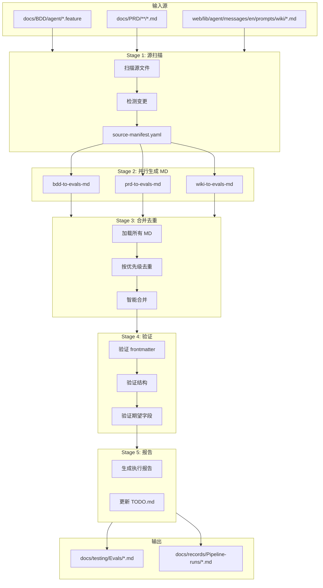

# 评估用例生成流水线设计

## 概述

创建新的评估测试用例生成流水线，从 BDD/PRD/Wiki 生成 MD 格式测试用例到 `docs/testing/Evals/`。

**关键决策**：
- MD 是 Single Source of Truth（唯一格式）
- 删除旧的 JSON 生成 agents
- 支持手动执行和源文档变更触发

---

## 架构图



---

## 实施步骤

### Phase 1: 清理旧 Agents（删除）

删除以下旧的 JSON 生成 agents：

| 文件 | 原因 |
|------|------|
| `.claude/agents/bdd-to-evals.md` | 生成 JSON，已废弃 |
| `.claude/agents/prd-to-evals.md` | 生成 JSON，已废弃 |
| `.claude/agents/wiki-to-evals.md` | 生成 JSON，已废弃 |
| `.claude/agents/eval-coordinator.md` | 协调 JSON 生成，已废弃 |

### Phase 2: 创建新 Agents

#### 2.1 evals-source-scanner.md（新建）
- **职责**：扫描 BDD/PRD/Wiki 源文件，检测变更
- **输入**：源目录路径
- **输出**：`docs/testing/Evals/.pipeline/source-manifest.yaml`
- **模型**：haiku

#### 2.2 bdd-to-evals-md.md（新建）
- **职责**：从 BDD 生成 MD 格式测试用例
- **输入**：`docs/BDD/agent/*.feature`
- **输出**：`docs/testing/Evals/{capabilities,e2e,edge_cases}/*.md`
- **模型**：sonnet

#### 2.3 prd-to-evals-md.md（新建）
- **职责**：从 PRD 提取可测试场景，生成 MD 用例
- **输入**：`docs/PRD/**/*.md`
- **输出**：`docs/testing/Evals/{capabilities,e2e}/*.md`
- **模型**：sonnet

#### 2.4 wiki-to-evals-md.md（新建）
- **职责**：从 Wiki 提取业务规则边界，生成边界测试
- **输入**：`web/lib/agent/messages/en/prompts/wiki/*.md`
- **输出**：`docs/testing/Evals/edge_cases/*.md`
- **模型**：sonnet

#### 2.5 evals-md-merger.md（新建）
- **职责**：合并多源 MD，执行去重和智能合并
- **去重优先级**：BDD > PRD > Wiki
- **保留规则**：`<!-- _custom: true -->` 标记的测试永远保留
- **模型**：sonnet

#### 2.6 evals-md-validator.md（新建）
- **职责**：验证 MD 格式
- **检查项**：frontmatter、测试结构、期望字段
- **参考**：`docs/operations/evals-test-guide.md`、`evals/schema/expectations.schema.yaml`
- **模型**：haiku

#### 2.7 evals-generate-coordinator.md（新建）
- **职责**：编排 5 个阶段的流水线
- **模型**：sonnet

### Phase 3: 更新 Skill

更新 `.claude/skills/eval-generate/SKILL.md`：
- 移除 JSON 相关内容
- 更新输出目录为 `docs/testing/Evals/`
- 添加新的流水线阶段说明

### Phase 4: 流水线输出目录

参考 `evals-pipeline` 的输出模式，每次运行创建独立文件夹：

```
docs/records/Pipeline-runs/YYYYMMDD-HHMMSS-eval-generate/
├── source-manifest.yaml     # Stage 1: 源扫描
├── bdd-generation.yaml      # Stage 2a: BDD 生成
├── prd-generation.yaml      # Stage 2b: PRD 生成
├── wiki-generation.yaml     # Stage 2c: Wiki 生成
├── merge-result.yaml        # Stage 3: 合并结果
├── validation-result.yaml   # Stage 4: 验证结果
└── REPORT.md                # 最终报告（含待办事项）
```

> **注意**: 待办事项直接写在报告的「待办事项」章节中，不再追加到根目录 `TODO.md`。

---

## 关键文件路径

### 要删除的文件
```
.claude/agents/bdd-to-evals.md
.claude/agents/prd-to-evals.md
.claude/agents/wiki-to-evals.md
.claude/agents/eval-coordinator.md
```

### 要创建的文件
```
.claude/agents/evals-source-scanner.md
.claude/agents/bdd-to-evals-md.md
.claude/agents/prd-to-evals-md.md
.claude/agents/wiki-to-evals-md.md
.claude/agents/evals-md-merger.md
.claude/agents/evals-md-validator.md
.claude/agents/evals-generate-coordinator.md
docs/testing/Evals/.pipeline/.gitkeep
```

### 要更新的文件
```
.claude/skills/eval-generate/SKILL.md
```

### 参考文件（只读）
```
docs/operations/evals-test-guide.md          # MD 格式规范
docs/testing/Evals/edge_cases/hermes-fico-boundary.md  # 示例 MD
evals/schema/expectations.schema.yaml        # 期望字段定义
```

---

## MD 测试用例格式

```markdown
---
category: edge_cases
priority: P0
tags: [hermes, fico, boundary, wiki]
source:
  type: wiki
  file: web/lib/agent/messages/en/prompts/wiki/gmcc-hermes-ca.md
  scenario: FICO Score Requirements
_generated:
  timestamp: "2025-12-21T10:00:00Z"
  agent: wiki-to-evals-md
---

# Hermes CA - FICO 边界测试

说明文本...

## 测试用例: FICO 679 - 刚好不合格

**输入**: 用户问题

**期望**:
- 包含: 关键词1, 关键词2
- 不包含: 排除词
- 审批: 拒绝

**说明**: 规则解释

---

## 测试用例: 自定义测试

<!-- _custom: true -->
**输入**: 手工添加的测试

**期望**:
- 包含: 特殊场景

**说明**: 这是手工添加的，合并时保留。
```

---

## Skill 用法

```bash
# 运行完整流水线（增量模式）
/eval-generate

# 指定源
/eval-generate --source bdd
/eval-generate --source wiki
/eval-generate --source all

# 全量重新生成
/eval-generate --overwrite

# 仅验证
/eval-generate --validate-only
```

---

## 去重算法

```python
priority = {"bdd": 3, "prd": 2, "wiki": 1}

def deduplicate(tests_by_source):
    merged = {}
    for source, tests in tests_by_source.items():
        for test in tests:
            if test.id not in merged:
                merged[test.id] = (test, priority[source])
            elif priority[source] > merged[test.id][1]:
                merged[test.id] = (test, priority[source])
    return [t[0] for t in merged.values()]
```

---

## 执行编排

参考 `evals-pipeline` 的编排模式：

```yaml
# 流水线执行计划
pipeline: eval-generate

# 运行目录（每次执行时创建）
run_dir: docs/records/Pipeline-runs/YYYYMMDD-HHMMSS-eval-generate/

stages:
  - stage: 1
    agent: evals-source-scanner
    input:
      - docs/BDD/agent/
      - docs/PRD/
      - web/lib/agent/messages/en/prompts/wiki/
    output: ${run_dir}/source-manifest.yaml
    blocking: true

  - stage: 2a
    agent: bdd-to-evals-md
    input:
      - docs/BDD/agent/
      - ${run_dir}/source-manifest.yaml
    output:
      - docs/testing/Evals/{capabilities,e2e,edge_cases}/*.md
      - ${run_dir}/bdd-generation.yaml
    blocking: false  # 可并行

  - stage: 2b
    agent: prd-to-evals-md
    input:
      - docs/PRD/
      - ${run_dir}/source-manifest.yaml
    output:
      - docs/testing/Evals/{capabilities,e2e}/*.md
      - ${run_dir}/prd-generation.yaml
    blocking: false  # 可并行

  - stage: 2c
    agent: wiki-to-evals-md
    input:
      - web/lib/agent/messages/en/prompts/wiki/
      - ${run_dir}/source-manifest.yaml
    output:
      - docs/testing/Evals/edge_cases/*.md
      - ${run_dir}/wiki-generation.yaml
    blocking: false  # 可并行

  - stage: 3
    agent: evals-md-merger
    input:
      - ${run_dir}/bdd-generation.yaml
      - ${run_dir}/prd-generation.yaml
      - ${run_dir}/wiki-generation.yaml
    output: ${run_dir}/merge-result.yaml
    blocking: true

  - stage: 4
    agent: evals-md-validator
    input:
      - docs/testing/Evals/
      - docs/operations/evals-test-guide.md
      - evals/schema/expectations.schema.yaml
    output: ${run_dir}/validation-result.yaml
    blocking: true

  - stage: 5
    agent: pipeline-report
    input:
      - ${run_dir}/source-manifest.yaml
      - ${run_dir}/merge-result.yaml
      - ${run_dir}/validation-result.yaml
    output: ${run_dir}/REPORT.md
    blocking: true
```

---

## 报告模板

```markdown
# Eval 生成报告

**生成时间**: YYYY-MM-DD HH:MM:SS
**运行目录**: docs/records/Pipeline-runs/YYYYMMDD-HHMMSS-eval-generate/

## 执行摘要

| 阶段 | 状态 | 耗时 |
|------|------|------|
| 源扫描 | ✅ 完成 | 2s |
| BDD 生成 | ✅ 完成 | 15s |
| PRD 生成 | ✅ 完成 | 12s |
| Wiki 生成 | ✅ 完成 | 8s |
| 合并去重 | ✅ 完成 | 3s |
| 验证 | ⚠️ 2 个警告 | 5s |

## 源处理统计

| 源 | 文件 | 场景/规则 | 生成测试 |
|----|------|----------|---------|
| BDD | 8 | 45 | 38 |
| PRD | 5 | 23 | 18 |
| Wiki | 3 | 18 | 24 |
| **总计** | 16 | 86 | 80 |

## 去重统计

- 去重前: 95 个测试
- 去重后: 80 个测试
- 移除重复: 15 个（BDD 优先保留）

## 验证结果

| 分类 | 文件数 | 测试数 | 状态 |
|------|--------|--------|------|
| capabilities | 6 | 28 | ✅ 全部通过 |
| e2e | 3 | 12 | ✅ 全部通过 |
| edge_cases | 12 | 40 | ⚠️ 2 个警告 |

## 待办事项

| 优先级 | 任务 | 文件 |
|--------|------|------|
| 🔴 高 | 修复 frontmatter 缺失 | edge_cases/hermes-dti.md |
| 🟡 中 | 确认期望值 | edge_cases/ocean-ltv.md |

## 生成的文件

### capabilities/
- fico.md (5 tests) - 新建
- dti.md (6 tests) - 更新
- ltv.md (4 tests) - 无变化

### e2e/
- us-citizen-purchase.md (6 turns) - 更新

### edge_cases/
- hermes-fico-boundary.md (11 tests) - 新建
- hermes-dti-boundary.md (8 tests) - 新建
...
```

---

## 实施顺序

1. 删除 4 个旧 agents
2. 创建 7 个新 agents
3. 更新 1 个 skill
4. 测试流水线
