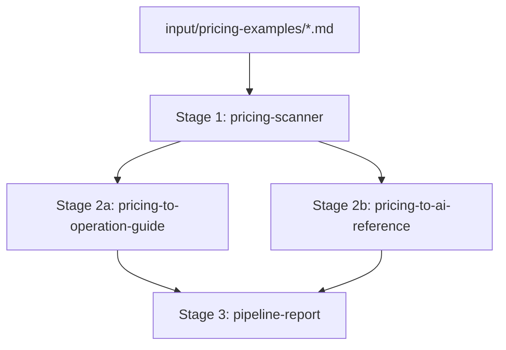
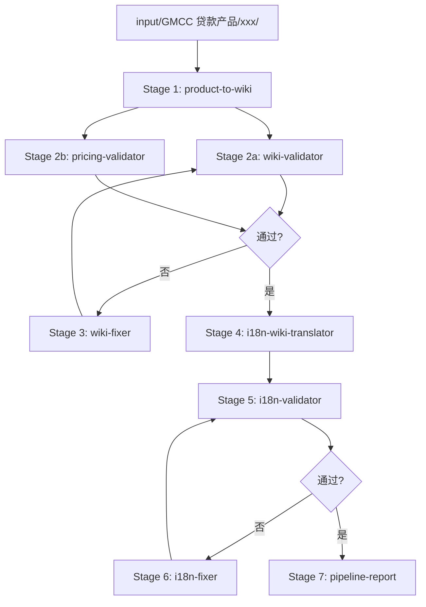

# 流水线创建计划：定价指南 + 产品转 Wiki

## 概述

创建两个独立流水线：
1. **pricing-to-guide-pipeline** - 从定价示例生成操作指南和 AI 验证参考
2. **product-to-wiki-pipeline** - 从产品文档生成双语 Wiki（英文 + 中文）

---

## 流水线 1: pricing-to-guide-pipeline

### 目标

从 `input/pricing-examples/*.md` 生成：
- 用户操作指南 → `docs/operations/pricing-guide-[product].md`
- AI 验证参考 → `docs/analysis/pricing-reference-[product].md`

### 阶段设计



| Stage | Agent | 模型 | 状态 | 输出 |
|-------|-------|------|------|------|
| 1 | pricing-scanner | haiku | 新建 | pricing-manifest.yaml |
| 2a | pricing-to-operation-guide | sonnet | 新建 | pricing-guide-*.md |
| 2b | pricing-to-ai-reference | sonnet | 新建 | pricing-reference-*.md |
| 3 | pipeline-report | haiku | 复用 | REPORT.md |

### 需要创建的文件

1. `.claude/skills/pricing-to-guide-pipeline/SKILL.md`
2. `.claude/agents/pricing-scanner.md`
3. `.claude/agents/pricing-to-operation-guide.md`
4. `.claude/agents/pricing-to-ai-reference.md`

---

## 流水线 2: product-to-wiki-pipeline

### 目标

从用户指定的产品路径生成：
- 英文 Wiki → `web/lib/agent/messages/en/prompts/wiki/gmcc-[product].md`
- 中文 Wiki → `web/lib/agent/messages/zh/prompts/wiki/gmcc-[product].md`

### 阶段设计



| Stage | Agent | 模型 | 状态 | 说明 |
|-------|-------|------|------|------|
| 1 | product-to-wiki | opus | 复用 | 生成英文 Wiki |
| 2a | wiki-validator | opus | 复用 | 验证信息完整性 |
| 2b | pricing-validator | opus | 复用 | 验证定价逻辑 |
| 3 | wiki-fixer | opus | 新建 | 修复 Wiki 问题 |
| 4 | i18n-wiki-translator | opus | **修改** | 改为英文→中文方向 |
| 5 | i18n-validator | haiku | 复用 | 验证翻译质量 |
| 6 | i18n-fixer | opus | 新建 | 修复翻译问题 |
| 7 | pipeline-report | haiku | 复用 | 生成报告 |

### 需要创建/修改的文件

1. `.claude/skills/product-to-wiki-pipeline/SKILL.md` - 新建
2. `.claude/agents/wiki-fixer.md` - 新建
3. `.claude/agents/i18n-fixer.md` - 新建
4. `.claude/agents/i18n-wiki-translator.md` - **修改方向**（中→英 改为 英→中）

---

## 实施步骤

### 第一阶段：定价流水线 (pricing-to-guide-pipeline)

1. 创建 `.claude/agents/pricing-scanner.md`
   - 扫描 `input/pricing-examples/*.md`
   - 输出 `pricing-manifest.yaml`

2. 创建 `.claude/agents/pricing-to-operation-guide.md`
   - 生成面向用户的操作指南
   - 简洁、实用、速查表格

3. 创建 `.claude/agents/pricing-to-ai-reference.md`
   - 生成面向 AI 的验证参考
   - 完整矩阵、边界值、测试用例

4. 创建 `.claude/skills/pricing-to-guide-pipeline/SKILL.md`
   - 完整流水线定义
   - Stage 编排和数据交接

### 第二阶段：产品转 Wiki 流水线 (product-to-wiki-pipeline)

1. 修改 `.claude/agents/i18n-wiki-translator.md`
   - 改为英文 → 中文方向
   - 保持术语对照表

2. 创建 `.claude/agents/wiki-fixer.md`
   - 根据验证报告修复 Wiki
   - 支持信息完整性和定价逻辑修复

3. 创建 `.claude/agents/i18n-fixer.md`
   - 根据验证报告修复翻译
   - 支持结构、术语、数字修复

4. 创建 `.claude/skills/product-to-wiki-pipeline/SKILL.md`
   - 完整流水线定义
   - 循环修复逻辑
   - 7 个 Stage 编排

---

## 关键文件路径

### 需要创建的文件 (7 个)

| 文件 | 类型 | 流水线 |
|------|------|--------|
| `.claude/skills/pricing-to-guide-pipeline/SKILL.md` | skill | 定价 |
| `.claude/agents/pricing-scanner.md` | agent | 定价 |
| `.claude/agents/pricing-to-operation-guide.md` | agent | 定价 |
| `.claude/agents/pricing-to-ai-reference.md` | agent | 定价 |
| `.claude/skills/product-to-wiki-pipeline/SKILL.md` | skill | Wiki |
| `.claude/agents/wiki-fixer.md` | agent | Wiki |
| `.claude/agents/i18n-fixer.md` | agent | Wiki |

### 需要修改的文件 (1 个)

| 文件 | 修改内容 |
|------|----------|
| `.claude/agents/i18n-wiki-translator.md` | 翻译方向改为英文→中文 |

### 参考文件

| 文件 | 用途 |
|------|------|
| `.claude/skills/evals-generate-pipeline/SKILL.md` | SKILL.md 模板 |
| `.claude/skills/product-to-wiki/SKILL.md` | 复用逻辑 |
| `.claude/agents/wiki-validator.md` | 验证规范 |
| `.claude/agents/pricing-guide.md` | 定价规则 |
| `input/pricing-examples/Pricing Calculation - Hermes.docx.md` | 输入示例 |

---

## 输出文档格式

### 操作指南格式 (pricing-guide-*.md)

```markdown
# [产品名] 定价计算指南

## 快速参考
| 项目 | 值 |
|------|-----|
| 基础利率 | x.xxx% |

## 计算步骤
1. 查找基础利率
2. 计算利率调整
3. 最终利率 = 基础利率 + 调整

## 利率调整速查
[简化表格]

## 计算示例
[完整示例]
```

### AI 验证参考格式 (pricing-reference-*.md)

```markdown
# [产品名] 定价验证参考

## 完整利率调整矩阵
[11 个完整矩阵]

## 叠加规则
总调整 = (a) + (b) + ... + (k)

## 边界值
[完整边界表]

## 验证测试用例
[验证用例表]
```

---

## 验收标准

1. **定价流水线**
   - 能扫描 `input/pricing-examples/` 下所有 `.md` 文件
   - 为每个产品生成操作指南和 AI 参考
   - 生成执行报告

2. **产品转 Wiki 流水线**
   - 能接受用户指定的产品路径
   - 生成英文和中文双语 Wiki
   - 验证失败时自动修复（最多 3 次）
   - 生成执行报告
