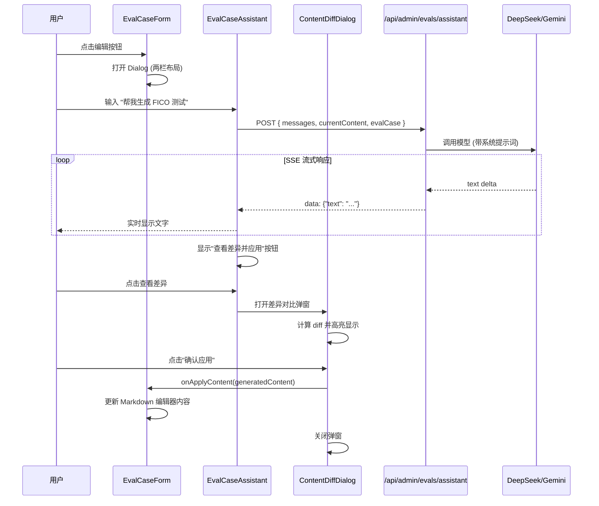

# AI 辅助编辑评估用例功能设计

## 功能概述

在评估用例编辑表单右侧添加 AI 对话面板，用户可以通过对话方式让 AI 帮助编辑 Markdown 测试用例内容。

## 用户场景

1. **生成新用例**: "帮我生成一个 FICO 680 边界测试用例"
2. **修改现有内容**: "把当前用例的 DTI 从 40% 改成 43%"
3. **优化格式**: "帮我把这个测试用例按标准格式整理一下"
4. **补充测试点**: "这个用例还缺少什么边界条件？"

---

## 技术方案

### 用户选择
- **布局**: 左右分栏
- **AI 模型**: DeepSeek V3.2 (最便宜) 或 Gemini Flash 3
- **应用方式**: 差异对比确认

### 方案选择: 扩展 Dialog 为左右分栏布局

```
┌─────────────────────────────────────────────────────────────┐
│                    编辑评估用例                              │
├─────────────────────────────┬───────────────────────────────┤
│        表单区域             │        AI 对话区域             │
│                             │                               │
│  标题: [___________]        │  ┌─────────────────────────┐  │
│  描述: [___________]        │  │ AI: 有什么可以帮你的？   │  │
│  分类: [▼ pricing  ]        │  │                         │  │
│  优先级: [▼ P0     ]        │  │ 用户: 帮我生成FICO测试  │  │
│  标签: [tag1][tag2][+]      │  │                         │  │
│                             │  │ AI: 好的，我来生成...   │  │
│  内容 (Markdown):           │  │ [查看差异并应用]        │  │
│  ┌─────────────────────┐    │  └─────────────────────────┘  │
│  │ # 测试用例          │    │                               │
│  │ ## 场景             │    │  ┌─────────────────────────┐  │
│  │ ...                 │    │  │ 输入消息...        [发送]│  │
│  └─────────────────────┘    │  └─────────────────────────┘  │
│                             │                               │
│         [取消]  [保存]      │                               │
└─────────────────────────────┴───────────────────────────────┘

                    ↓ 点击"查看差异并应用"

┌─────────────────────────────────────────────────────────────┐
│                    内容差异对比                              │
├─────────────────────────────────────────────────────────────┤
│  - # 旧测试用例                                              │
│  + # FICO 680 边界测试                                       │
│                                                             │
│  - ## 场景                                                   │
│  + ## 测试场景                                               │
│  + 用户 FICO 分数为 680，刚好在边界...                        │
│                                                             │
│                          [取消]  [确认应用]                  │
└─────────────────────────────────────────────────────────────┘
```

---

## 实现步骤

### Phase 1: API 端点

**创建**: `/api/admin/evals/assistant/route.ts`

```typescript
POST /api/admin/evals/assistant
{
  messages: UIMessage[];           // 对话历史
  currentContent: string;          // 当前编辑器的 Markdown 内容
  evalCase: {                      // 当前用例元信息
    title: string;
    category: string;
    priority: string;
    tags: string[];
  };
}

响应: SSE 流式响应
```

**Agent 配置**:
- 专用系统提示词，专注于评估用例编辑
- 无需复杂工具，主要是文本生成
- 提供"应用到编辑器"的结构化输出

### Phase 2: UI 组件

**修改**: `eval-case-form.tsx`

1. 扩展 Dialog 宽度为 `max-w-6xl`
2. 内部使用 grid 两栏布局
3. 左侧: 现有表单
4. 右侧: 新增 `EvalCaseAssistant` 组件

**新建**: `eval-case-assistant.tsx`

```typescript
interface EvalCaseAssistantProps {
  currentContent: string;                    // 当前编辑器内容
  evalCase: Partial<EvalCaseFormData>;       // 当前表单数据
  onApplyContent: (content: string) => void; // 应用内容到编辑器
}
```

**新建**: `content-diff-dialog.tsx` (差异对比弹窗)

```typescript
interface ContentDiffDialogProps {
  open: boolean;
  onOpenChange: (open: boolean) => void;
  originalContent: string;      // 原始内容
  newContent: string;           // AI 生成的新内容
  onConfirm: () => void;        // 确认应用
}
```

使用 `diff` 库生成差异，react-diff-viewer 组件展示:
- 绿色高亮: 新增内容
- 红色高亮: 删除内容
- 行号对比显示

### Phase 3: 对话交互

1. 使用 `useChat` hook 连接 API
2. AI 生成内容后显示"应用到编辑器"按钮
3. 点击按钮将内容填入 Markdown 编辑器
4. 支持流式显示 AI 回复

---

## 关键文件

| 文件 | 操作 | 说明 |
|------|------|------|
| `/app/api/admin/evals/assistant/route.ts` | 新建 | AI 对话 API |
| `/components/admin/eval-case-form.tsx` | 修改 | 扩展为两栏布局 |
| `/components/admin/eval-case-assistant.tsx` | 新建 | AI 对话组件 |
| `/components/admin/content-diff-dialog.tsx` | 新建 | 差异对比弹窗 |
| `/lib/agent/prompts/eval-assistant.ts` | 新建 | 专用系统提示词 |

### 依赖安装

```bash
npm install react-diff-viewer-continued
```

---

## 验收标准

### 功能验收

| 编号 | 功能点 | 验收标准 |
|------|--------|----------|
| A.1 | 对话面板 | 编辑表单右侧显示 AI 对话区域 |
| A.2 | 发送消息 | 可输入消息并发送给 AI |
| A.3 | 流式回复 | AI 回复流式显示 |
| A.4 | 查看差异 | AI 生成内容后可查看与当前内容的差异 |
| A.5 | 差异对比 | 差异弹窗正确高亮新增(绿)和删除(红)内容 |
| A.6 | 确认应用 | 用户确认后内容应用到编辑器 |
| A.7 | 上下文感知 | AI 能读取当前编辑器内容进行修改 |
| A.8 | 对话历史 | 支持多轮对话 |

### 测试场景

1. **生成测试**: 请 AI 生成新用例 → 查看差异 → 确认应用到编辑器
2. **修改测试**: 让 AI 修改现有内容 → 差异对比显示修改 → 确认应用
3. **取消应用**: 查看差异后点击取消 → 编辑器内容不变
4. **多轮对话**: 连续对话完善用例 → 验证上下文保持
5. **错误处理**: 网络失败时显示错误提示

---

## 测试方案

### 单元测试

```typescript
// eval-case-assistant.test.tsx
describe('EvalCaseAssistant', () => {
  test('发送消息调用 API', async () => {...});
  test('AI 回复后显示查看差异按钮', async () => {...});
  test('显示加载状态', async () => {...});
  test('处理 API 错误', async () => {...});
});

// content-diff-dialog.test.tsx
describe('ContentDiffDialog', () => {
  test('正确显示新增内容(绿色)', async () => {...});
  test('正确显示删除内容(红色)', async () => {...});
  test('点击确认应用调用 onConfirm', async () => {...});
  test('点击取消关闭弹窗', async () => {...});
});
```

### E2E 测试

```typescript
// evals-ai-assistant.spec.ts
test('AI 辅助生成测试用例', async ({ page }) => {
  await page.goto('/admin/evals');
  await page.click('text=创建用例');

  // 在 AI 面板输入
  await page.fill('[data-testid="ai-input"]', '生成一个 FICO 680 边界测试');
  await page.click('[data-testid="ai-send"]');

  // 等待 AI 回复，点击查看差异
  await page.waitForSelector('[data-testid="view-diff-button"]');
  await page.click('[data-testid="view-diff-button"]');

  // 验证差异对比弹窗显示
  await expect(page.getByText('内容差异对比')).toBeVisible();

  // 确认应用
  await page.click('[data-testid="confirm-apply"]');

  // 验证编辑器内容更新
  const content = await page.inputValue('[data-testid="content-textarea"]');
  expect(content).toContain('FICO');
});

test('取消应用保持原内容', async ({ page }) => {
  // ... 类似流程，但点击取消
  await page.click('[data-testid="cancel-apply"]');
  // 验证内容未变
});
```

---

## 时序图



---

## 注意事项

1. **性能**: 对话面板应懒加载，不影响表单初始渲染
2. **状态隔离**: 对话状态独立于表单状态
3. **错误处理**: API 失败时显示友好提示，不影响表单保存
4. **可选性**: 对话面板可折叠，用户可选择不使用
