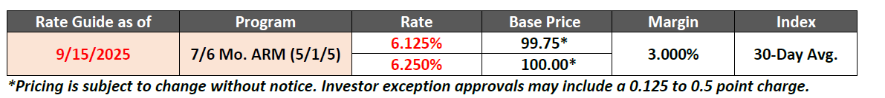
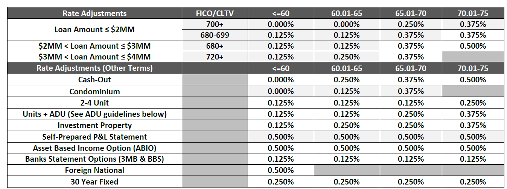
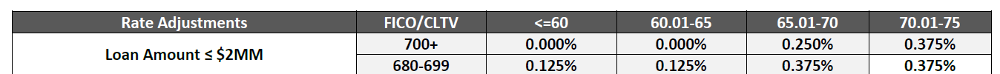
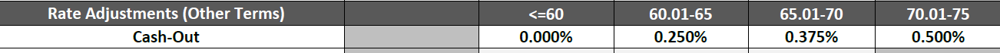
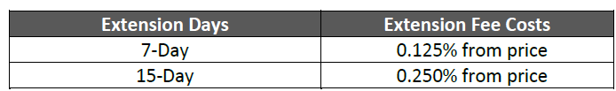

**Pricing Calculation - Hermes Program**

1. **Base Rate:** ReadBase Rate from the table below. 6.125% rate has base price 99.75%, and 6.25% Rate has price at par.

1. **Rate Adjustment**

1. Loan Amount/FICO: check loan amount, FICO and CLTV (if CLTV is not provided, assume CLTV = LTV or AI asks for more information)

Example:

If Loan amount <=2mm and FICO >=700, LTV <=60, rate adjustment = 0, if LTV is 60.01 to 65%, rate adjustment =0, if LTV is 65.01 to 70%, rate adjustment = 0.25%, if LTV is 70.01 to 75%, rate adjustment = 0.375%

1. Cash- Out: if loan purpose = cash out, check LTV and use this table.

Rate Adjustment = Rate Adjustment from 1 +

0%（if LTV <=60%）

0.25% (60.01< =LTV <= 65%)

0.375% if ( 65.01 <=LTV <=70%)

0.5% if (70.01<=LTV <= 75%)

1. Condo: check property type and LTV
2. Units+ ADU : check units and LTV
3. Investment property: check Occupancy and LTV
4. Self- Prepared P&L statement: Check Documentation Type and LTV
5. Asset Based Income: check documentation type and LTV
6. Bank Statement: check documentation type and LTV
7. Foreign National: if the borrower is foreign, check LTV
8. Loan program: if it’s 30yr fixed, check LTV
9. **Example:**

Loan Amount 2mm, FICO 720, LTV 68%, Cash Out, 2-4 Units, Investment property, Bank Statement, 30 year fixed

**Rate Adjustment =** 0.25% (Loan Amount/FICO/LTV)

+ 0.375%(Cash Out)

+ 0.125%(2-4 Units)

+ 0.25%(Investment Property)

+ 0.125%(Bank Statement)

+ 0.25%(30 yr fixed)

= 1.375%

**Final Rate= Base Rate + Rate Adjustment**

|  |  |  |
| --- | --- | --- |
| **Program** | **Rate** | **Price** |
| **Hermes 7/6 ARM** | **7.5% （6.125+1.375）** | **99.75** |
| **7.625% ( 6.25 + 1.375)** | **100** |

1. **Extension:**

AI asks if extension is needed, if so

-----------------------------------------------------------------------------------------------------

Mortgage Terms:

1. Documentation:
   1. Full Doc
   2. Bank Statement
   3. P&L
   4. Asset Based / Asset Utilization
   5. 1099
   6. WVOE
2. Occupancy
   1. Primary
   2. Investment Property
   3. Second Home
   4. Vacant
3. Loan Purpose:
   1. Cash Out
   2. Purchase
   3. Rate/Term Refi
4. Property Type
   1. SFR (Single Family Residential)
   2. Condo
   3. 2-4 units
   4. Multi-family 5+ Units