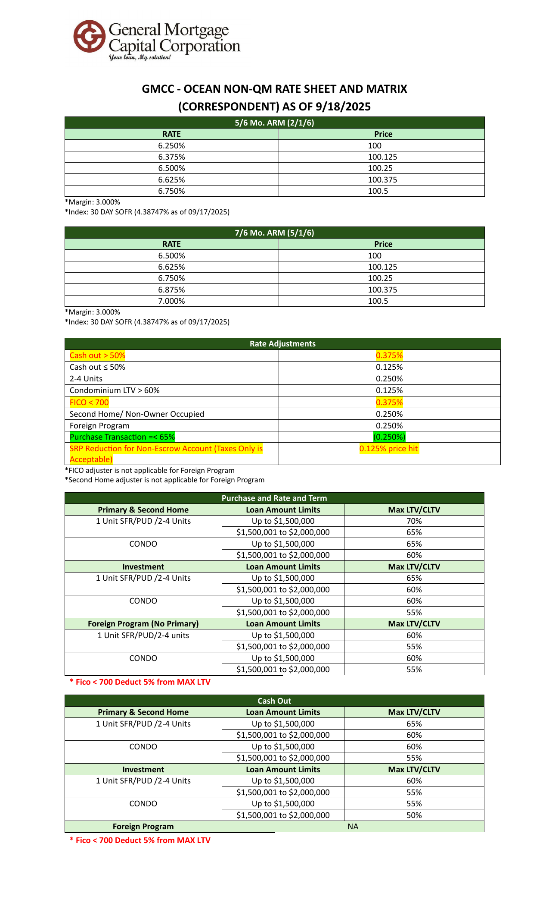
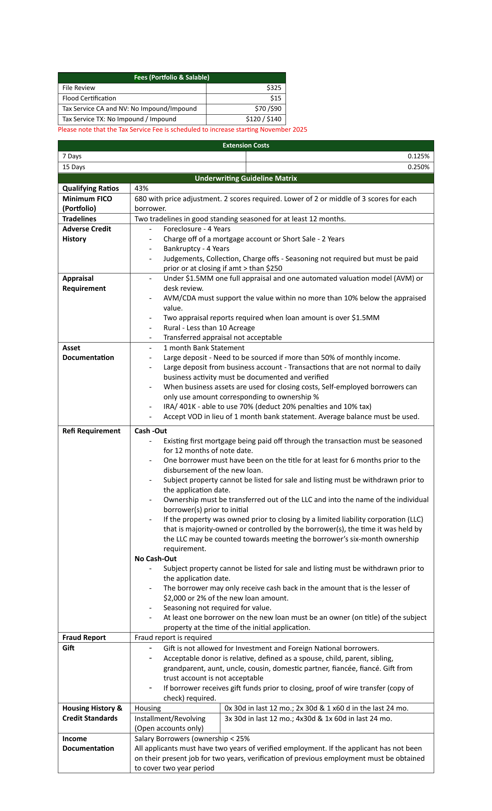
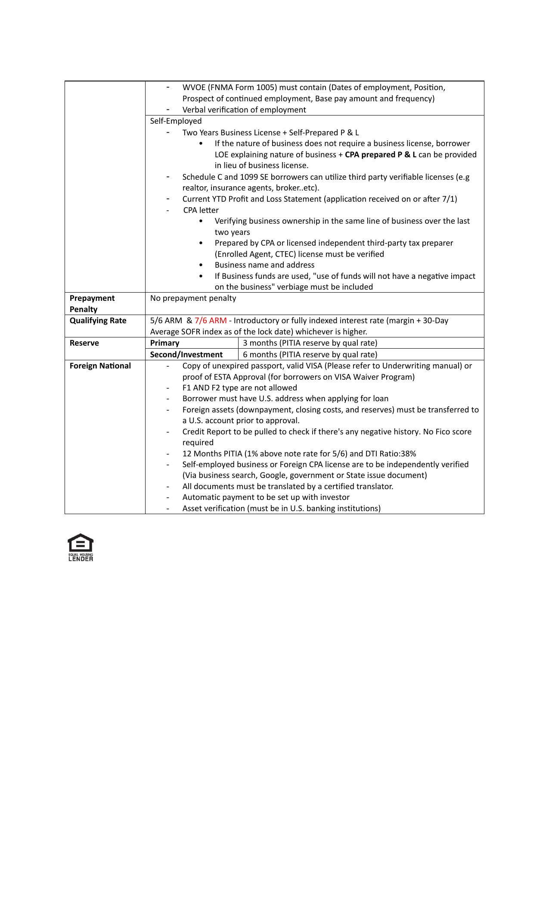

# PDF: GMCC Ocean Rate Sheet 9.18.2025.pdf

## Page 1

# **GMCC - OCEAN NON-QM RATE SHEET AND MATRIX** **(CORRESPONDENT) AS OF 9/18/2025**

|5/6 Mo. ARM (2/1/6)|Col2|
|---|---|
|**RATE**|~~**Price**~~  |
|6.250%|~~100~~ |
|6.375%|~~100.125~~ |
|6.500%|~~100.25~~ |
|6.625%|~~100.375~~ |
|6.750%|~~100.5~~|

*Margin: 3.000%
*Index: 30 DAY SOFR (4.38747% as of 09/17/2025)

|7/6 Mo. ARM (5/1/6)|Col2|
|---|---|
|**RATE**|~~**Price**~~  |
|6.500%|~~100~~ |
|6.625%|~~100.125~~ |
|6.750%|~~100.25~~ |
|6.875%|~~100.375~~ |
|7.000%|~~100.5~~|

*Margin: 3.000%
*Index: 30 DAY SOFR (4.38747% as of 09/17/2025)

|Rate Adjustments|Col2|
|---|---|
|Cash out > 50%|0.375%|
|Cash out ≤ 50%|0.125%|
|2-4 Units|0.250%|
|Condominium LTV > 60%|0.125%|
|FICO < 700|0.375%|
|Second Home/ Non-Owner Occupied|0.250%|
|Foreign Program|0.250%|
|Purchase Transacton =< 65%|(0.250%) |
|SRP Reducton for Non-Escrow Account (Taxes Only is Acceptable)|0.125%~~price hit~~|

*FICO adjuster is not applicable for Foreign Program
*Second Home adjuster is not applicable for Foreign Program

---

## Page 2

|Purchase and Rate and Term|Col2|Col3|Col4|Col5|
|---|---|---|---|---|
|**Primary & Second Home**|**Loan Amount Limits**|**Loan Amount Limits**|**Loan Amount Limits**|**Max LTV/CLTV**|
|1 Unit SFR/PUD /2-4 Units|Up to $1,500,000|Up to $1,500,000|Up to $1,500,000|70%|
|1 Unit SFR/PUD /2-4 Units|$1,500,001 to $2,000,000|$1,500,001 to $2,000,000|$1,500,001 to $2,000,000|65%|
|CONDO|Up to $1,500,000|Up to $1,500,000|Up to $1,500,000|65%|
|CONDO|$1,500,001 to $2,000,000|$1,500,001 to $2,000,000|$1,500,001 to $2,000,000|60%|
|**Investment**|**Loan Amount Limits**|**Loan Amount Limits**|**Loan Amount Limits**|**Max LTV/CLTV**|
|1 Unit SFR/PUD /2-4 Units|Up to $1,500,000|Up to $1,500,000|Up to $1,500,000|65%|
|1 Unit SFR/PUD /2-4 Units|$1,500,001 to $2,000,000|$1,500,001 to $2,000,000|$1,500,001 to $2,000,000|60%|
|CONDO|Up to $1,500,000|Up to $1,500,000|Up to $1,500,000|60%|
|CONDO|$1,500,001 to $2,000,000|$1,500,001 to $2,000,000|$1,500,001 to $2,000,000|55%|
|**Foreign Program (No Primary)**|**Loan Amount Limits**|**Loan Amount Limits**|**Loan Amount Limits**|**Max LTV/CLTV**|
|1 Unit SFR/PUD/2-4 units|Up to $1,500,000|Up to $1,500,000|Up to $1,500,000|60%|
|1 Unit SFR/PUD/2-4 units|$1,500,001 to $2,000,000|$1,500,001 to $2,000,000|$1,500,001 to $2,000,000|55%|
|CONDO|Up to $1,500,000|Up to $1,500,000|Up to $1,500,000|60%|
|CONDO|$1,500,001 to $2,000,000|$1,500,001 to $2,000,000|$1,500,001 to $2,000,000|55%|
|*** Fico < 700 Deduct 5% from MAX LTV**|*** Fico < 700 Deduct 5% from MAX LTV**|*** Fico < 700 Deduct 5% from MAX LTV**|||
|**Cash Out **|**Cash Out **|**Cash Out **|**Cash Out **|**Cash Out **|
|**Primary & Second Home**|**Loan Amount Limits**|**Loan Amount Limits**|**Loan Amount Limits**|**Max LTV/CLTV**|
|1 Unit SFR/PUD /2-4 Units|Up to $1,500,000|Up to $1,500,000|Up to $1,500,000|65%|
|1 Unit SFR/PUD /2-4 Units|$1,500,001 to $2,000,000|$1,500,001 to $2,000,000|$1,500,001 to $2,000,000|60%|
|CONDO|Up to $1,500,000|Up to $1,500,000|Up to $1,500,000|60%|
|CONDO|$1,500,001 to $2,000,000|$1,500,001 to $2,000,000|$1,500,001 to $2,000,000|55%|
|**Investment**|**Loan Amount Limits**|**Loan Amount Limits**|**Loan Amount Limits**|**Max LTV/CLTV**|
|1 Unit SFR/PUD /2-4 Units|Up to $1,500,000|Up to $1,500,000|Up to $1,500,000|60%|
|1 Unit SFR/PUD /2-4 Units|$1,500,001 to $2,000,000|$1,500,001 to $2,000,000|$1,500,001 to $2,000,000|55%|
|CONDO|Up to $1,500,000|Up to $1,500,000|Up to $1,500,000|55%|
|CONDO|$1,500,001 to $2,000,000|$1,500,001 to $2,000,000|$1,500,001 to $2,000,000|50%|
|**Foreign Program**|NA|NA|NA|NA|
|*** Fico < 700 Deduct 5% from MAX LTV** |*** Fico < 700 Deduct 5% from MAX LTV** ||||

|Fees (Portof lio & Salable)|Col2|
|---|---|
|File Review|$325|
|Flood Certfcaton|$15|
|Tax Service CA and NV: No Impound/Impound|$70 /$90|
|Tax Service TX: No Impound / Impound|$120 / $140|

Please note that the Tax Service Fee is scheduled to increase starting November 2025

---

## Page 3

|Extension Costs|Col2|Col3|Col4|
|---|---|---|---|
|7 Days|7 Days|7 Days|0.125%|
|15 Days|15 Days|15 Days|0.250%|
|**Underwritng Guideline Matrix **|**Underwritng Guideline Matrix **|**Underwritng Guideline Matrix **|**Underwritng Guideline Matrix **|
|**Qualifying Ratos**|43%|43%|43%|
|**Minimum FICO** **(Portolio)**|680 with price adjustment. 2 scores required. Lower of 2 or middle of 3 scores for each borrower.|680 with price adjustment. 2 scores required. Lower of 2 or middle of 3 scores for each borrower.|680 with price adjustment. 2 scores required. Lower of 2 or middle of 3 scores for each borrower.|
|**Tradelines**|Two tradelines in good standing seasoned for at least 12 months.|Two tradelines in good standing seasoned for at least 12 months.|Two tradelines in good standing seasoned for at least 12 months.|
|**Adverse Credit** **History**|- Foreclosure - 4 Years - Charge of of a mortgage account or Short Sale - 2 Years - Bankruptcy - 4 Years - Judgements, Collecton, Charge ofs - Seasoning not required but must be paid prior or at closing if amt > than $250|- Foreclosure - 4 Years - Charge of of a mortgage account or Short Sale - 2 Years - Bankruptcy - 4 Years - Judgements, Collecton, Charge ofs - Seasoning not required but must be paid prior or at closing if amt > than $250|- Foreclosure - 4 Years - Charge of of a mortgage account or Short Sale - 2 Years - Bankruptcy - 4 Years - Judgements, Collecton, Charge ofs - Seasoning not required but must be paid prior or at closing if amt > than $250|
|**Appraisal** **Requirement**|- Under $1.5MM one full appraisal and one automated valuaton model (AVM) or desk review. - AVM/CDA must support the value within no more than 10% below the appraised value. - Two appraisal reports required when loan amount is over $1.5MM - Rural - Less than 10 Acreage - Transferred appraisal not acceptable|- Under $1.5MM one full appraisal and one automated valuaton model (AVM) or desk review. - AVM/CDA must support the value within no more than 10% below the appraised value. - Two appraisal reports required when loan amount is over $1.5MM - Rural - Less than 10 Acreage - Transferred appraisal not acceptable|- Under $1.5MM one full appraisal and one automated valuaton model (AVM) or desk review. - AVM/CDA must support the value within no more than 10% below the appraised value. - Two appraisal reports required when loan amount is over $1.5MM - Rural - Less than 10 Acreage - Transferred appraisal not acceptable|
|**Asset** **Documentaton**|- 1 month Bank Statement - Large deposit - Need to be sourced if more than 50% of monthly income. - Large deposit from business account - Transactons that are not normal to daily business actvity must be documented and verifed - When business assets are used for closing costs, Self-employed borrowers can only use amount corresponding to ownership % - IRA/ 401K - able to use 70% (deduct 20% penaltes and 10% tax) - Accept VOD in lieu of 1 month bank statement. Average balance must be used.|- 1 month Bank Statement - Large deposit - Need to be sourced if more than 50% of monthly income. - Large deposit from business account - Transactons that are not normal to daily business actvity must be documented and verifed - When business assets are used for closing costs, Self-employed borrowers can only use amount corresponding to ownership % - IRA/ 401K - able to use 70% (deduct 20% penaltes and 10% tax) - Accept VOD in lieu of 1 month bank statement. Average balance must be used.|- 1 month Bank Statement - Large deposit - Need to be sourced if more than 50% of monthly income. - Large deposit from business account - Transactons that are not normal to daily business actvity must be documented and verifed - When business assets are used for closing costs, Self-employed borrowers can only use amount corresponding to ownership % - IRA/ 401K - able to use 70% (deduct 20% penaltes and 10% tax) - Accept VOD in lieu of 1 month bank statement. Average balance must be used.|
|**Ref Requirement**|**Cash -Out** - Existng frst mortgage being paid of through the transacton must be seasoned for 12 months of note date. - One borrower must have been on the ttle for at least for 6 months prior to the disbursement of the new loan. - Subject property cannot be listed for sale and listng must be withdrawn prior to the applicaton date. - Ownership must be transferred out of the LLC and into the name of the individual borrower(s) prior to inital - If the property was owned prior to closing by a limited liability corporaton (LLC) that is majority-owned or controlled by the borrower(s), the tme it was held by the LLC may be counted towards meetng the borrower’s six-month ownership requirement. **No Cash-Out** - Subject property cannot be listed for sale and listng must be withdrawn prior to the applicaton date. - The borrower may only receive cash back in the amount that is the lesser of $2,000 or 2% of the new loan amount. - Seasoning not required for value. - At least one borrower on the new loan must be an owner (on ttle) of the subject property at the tme of the inital applicaton.|**Cash -Out** - Existng frst mortgage being paid of through the transacton must be seasoned for 12 months of note date. - One borrower must have been on the ttle for at least for 6 months prior to the disbursement of the new loan. - Subject property cannot be listed for sale and listng must be withdrawn prior to the applicaton date. - Ownership must be transferred out of the LLC and into the name of the individual borrower(s) prior to inital - If the property was owned prior to closing by a limited liability corporaton (LLC) that is majority-owned or controlled by the borrower(s), the tme it was held by the LLC may be counted towards meetng the borrower’s six-month ownership requirement. **No Cash-Out** - Subject property cannot be listed for sale and listng must be withdrawn prior to the applicaton date. - The borrower may only receive cash back in the amount that is the lesser of $2,000 or 2% of the new loan amount. - Seasoning not required for value. - At least one borrower on the new loan must be an owner (on ttle) of the subject property at the tme of the inital applicaton.|**Cash -Out** - Existng frst mortgage being paid of through the transacton must be seasoned for 12 months of note date. - One borrower must have been on the ttle for at least for 6 months prior to the disbursement of the new loan. - Subject property cannot be listed for sale and listng must be withdrawn prior to the applicaton date. - Ownership must be transferred out of the LLC and into the name of the individual borrower(s) prior to inital - If the property was owned prior to closing by a limited liability corporaton (LLC) that is majority-owned or controlled by the borrower(s), the tme it was held by the LLC may be counted towards meetng the borrower’s six-month ownership requirement. **No Cash-Out** - Subject property cannot be listed for sale and listng must be withdrawn prior to the applicaton date. - The borrower may only receive cash back in the amount that is the lesser of $2,000 or 2% of the new loan amount. - Seasoning not required for value. - At least one borrower on the new loan must be an owner (on ttle) of the subject property at the tme of the inital applicaton.|
|**Fraud Report**|Fraud report is required|Fraud report is required|Fraud report is required|
|**Gif**|- Gif is not allowed for Investment and Foreign Natonal borrowers. - Acceptable donor is relatve, defned as a spouse, child, parent, sibling, grandparent, aunt, uncle, cousin, domestc partner, fancée, fancé. Gif from trust account is not acceptable - If borrower receives gif funds prior to closing, proof of wire transfer (copy of check) required.|- Gif is not allowed for Investment and Foreign Natonal borrowers. - Acceptable donor is relatve, defned as a spouse, child, parent, sibling, grandparent, aunt, uncle, cousin, domestc partner, fancée, fancé. Gif from trust account is not acceptable - If borrower receives gif funds prior to closing, proof of wire transfer (copy of check) required.|- Gif is not allowed for Investment and Foreign Natonal borrowers. - Acceptable donor is relatve, defned as a spouse, child, parent, sibling, grandparent, aunt, uncle, cousin, domestc partner, fancée, fancé. Gif from trust account is not acceptable - If borrower receives gif funds prior to closing, proof of wire transfer (copy of check) required.|
|**Housing History &** **Credit Standards**|Housing|0x 30d in last 12 mo.; 2x 30d & 1 x60 d in the last 24 mo.|0x 30d in last 12 mo.; 2x 30d & 1 x60 d in the last 24 mo.|
|**Housing History &** **Credit Standards**|Installment/Revolving (Open accounts only)|3x 30d in last 12 mo.; 4x30d & 1x 60d in last 24 mo.|3x 30d in last 12 mo.; 4x30d & 1x 60d in last 24 mo.|
|**Income** **Documentaton**|Salary Borrowers (ownership < 25% All applicants must have two years of verifed employment. If the applicant has not been on their present job for two years, verifcaton of previous employment must be obtained to cover two year period|Salary Borrowers (ownership < 25% All applicants must have two years of verifed employment. If the applicant has not been on their present job for two years, verifcaton of previous employment must be obtained to cover two year period|Salary Borrowers (ownership < 25% All applicants must have two years of verifed employment. If the applicant has not been on their present job for two years, verifcaton of previous employment must be obtained to cover two year period|

|Col1|- WVOE (FNMA Form 1005) must contain (Dates of employment, Position, Prospect of continued employment, Base pay amount and frequency) - Verbal verification of employment|Col3|
|---|---|---|
||Self-Employed - Two Years Business License + Self-Prepared P & L • If the nature of business does not require a business license, borrower LOE explaining nature of business +**CPA prepared P & L** can be provided in lieu of business license. - Schedule C and 1099 SE borrowers can utlize third party verifable licenses (e.g realtor, insurance agents, broker..etc). - Current YTD Proft and Loss Statement (applicaton received on or afer 7/1) - CPA leter • Verifying business ownership in the same line of business over the last two years • Prepared by CPA or licensed independent third-party tax preparer (Enrolled Agent, CTEC) license must be verifed • Business name and address • If Business funds are used, "use of funds will not have a negatve impact on the business" verbiage must be included|Self-Employed - Two Years Business License + Self-Prepared P & L • If the nature of business does not require a business license, borrower LOE explaining nature of business +**CPA prepared P & L** can be provided in lieu of business license. - Schedule C and 1099 SE borrowers can utlize third party verifable licenses (e.g realtor, insurance agents, broker..etc). - Current YTD Proft and Loss Statement (applicaton received on or afer 7/1) - CPA leter • Verifying business ownership in the same line of business over the last two years • Prepared by CPA or licensed independent third-party tax preparer (Enrolled Agent, CTEC) license must be verifed • Business name and address • If Business funds are used, "use of funds will not have a negatve impact on the business" verbiage must be included|
|**Prepayment** **Penalty**|No prepayment penalty|No prepayment penalty|
|**Qualifying Rate**|5/6 ARM  &7/6 ARM- Introductory or fully indexed interest rate (margin + 30-Day Average SOFR index as of the lock date) whichever is higher.|5/6 ARM  &7/6 ARM- Introductory or fully indexed interest rate (margin + 30-Day Average SOFR index as of the lock date) whichever is higher.|
|**Reserve**|**Primary**|3 months (PITIA reserve by qual rate)|
|**Reserve**|**Second/Investment** |6 months (PITIA reserve by qual rate) |
|**Foreign Natonal**|- Copy of unexpired passport, valid VISA (Please refer to Underwriting manual) or  proof of ESTA Approval (for borrowers on VISA Waiver Program) - F1 AND F2 type are not allowed - Borrower must have U.S. address when applying for loan - Foreign assets (downpayment, closing costs, and reserves) must be transferred to a U.S. account prior to approval. - Credit Report to be pulled to check if there's any negative history. No Fico score required - 12 Months PITIA (1% above note rate for 5/6) and DTI Ratio:38% - Self-employed business or Foreign CPA license are to be independently verified (Via business search, Google, government or State issue document) - All documents must be translated by a certified translator. - Automatic payment to be set up with investor - Asset verification (must be in U.S. banking institutions)|- Copy of unexpired passport, valid VISA (Please refer to Underwriting manual) or  proof of ESTA Approval (for borrowers on VISA Waiver Program) - F1 AND F2 type are not allowed - Borrower must have U.S. address when applying for loan - Foreign assets (downpayment, closing costs, and reserves) must be transferred to a U.S. account prior to approval. - Credit Report to be pulled to check if there's any negative history. No Fico score required - 12 Months PITIA (1% above note rate for 5/6) and DTI Ratio:38% - Self-employed business or Foreign CPA license are to be independently verified (Via business search, Google, government or State issue document) - All documents must be translated by a certified translator. - Automatic payment to be set up with investor - Asset verification (must be in U.S. banking institutions)|

---

