# 演示文稿: Essential - GMCC Ocean 12-23-2025 v3.pptx

## Slide 1

# GMCC OceanIn House Underwriting

Proprietary & Confidential. For GMCC Mortgage Professionals Only.  Distribution is strictly prohibited
									V4 12-23-2025

GMCC Ocean

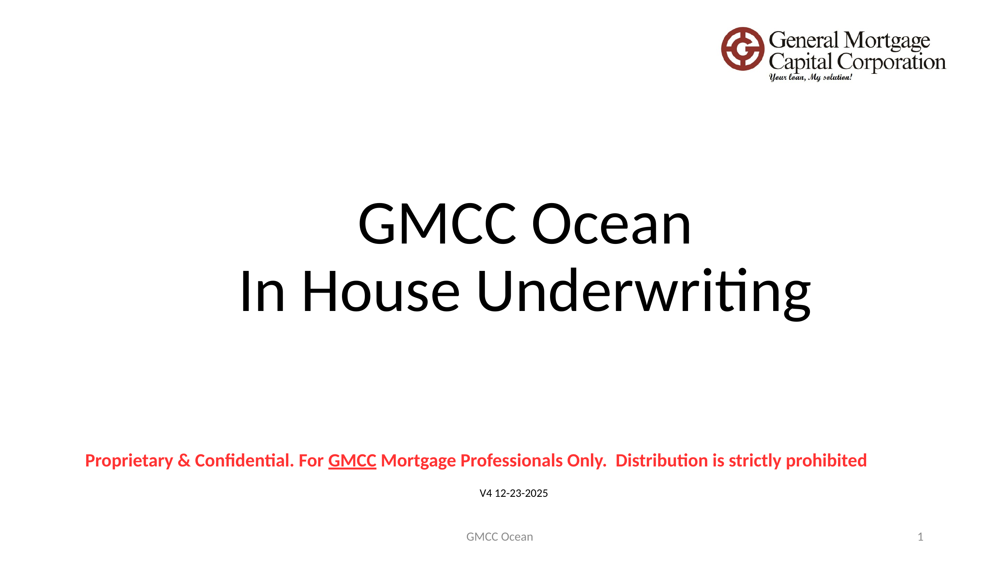

---

## Slide 2

# Special

5/6 ARM – 5.875% at par (as of 12-23-2025)-Exclusively for GMCC
Pricing on rate sheet – Send out by Jarrad
Reserve requirements – 3-6 months + additional for departing
Ocean is available in CA, TX, NV
No tax documents needed (no tax return, no w2, no paystubs, no 4506-C)
WVOE, CPA prepared P&L, Borrower prepared P&L
100% gift funds ok for primary only
Citizen, green card holder, and foreign national ok (No EAD card holder at this time)
NO PPP for investment.
Max 10 financed properties
Private landlord VOR OK-No need for proof of rent payment

GMCC Ocean

---

## Slide 3

# Programs

3 ways to qualify:

WVOE for wage earners (less then 25% ownership in the business)
CPA prepared P&L
3)   Borrower prepared P&L

GMCC Ocean

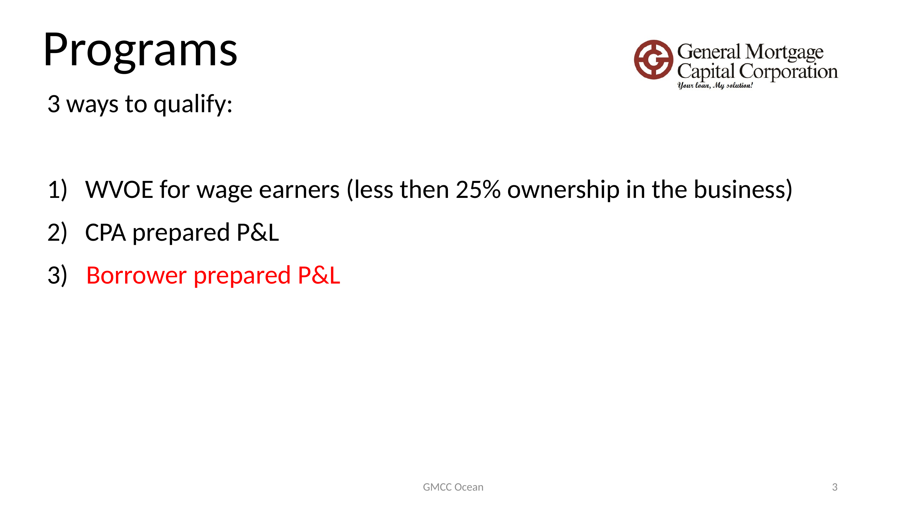

---

## Slide 4

# Programs

No hit for Borrower prepared P&L
Example:
US citizen with 700 FICO
Purchase SFR as primary
No price adj is needed so pricing is
5.875% at 100
0.25% Rate reduction for purchase transaction LTV<=60%

GMCC Ocean

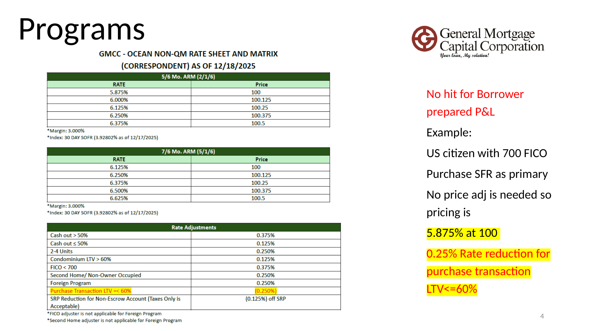

---

## Slide 5

# Programs

GMCC Ocean

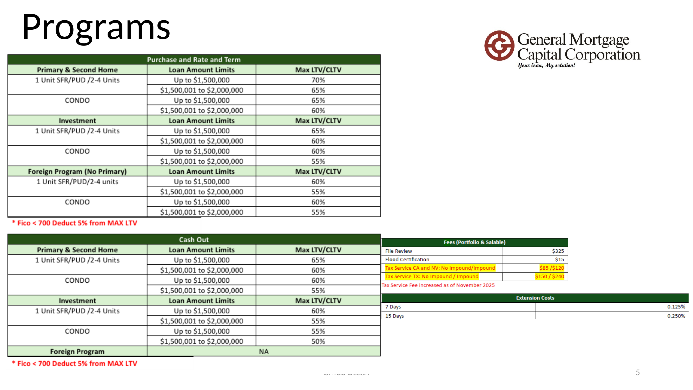

---

## Slide 6

# Eligible borrower

US Citizen
Permanent Resident
Working VISA holder – ok – E1, E2, G1 to G5, H1b, L1
Foreign National ok, no F1 &F2
POA ok – except for foreign national and for cashout transactions.
Co-signor – not allowed
Non-occupant Co-Borrower – ok for primary– must be on title
Tenants in common vesting – not allowed

GMCC Ocean

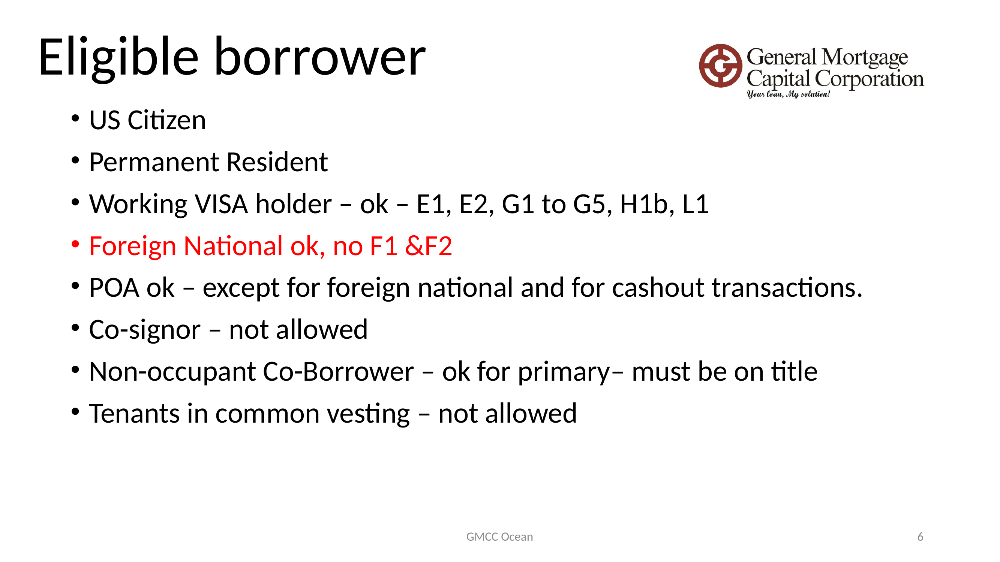

---

## Slide 7

# Eligible borrower

Foreign National
no borrower prepared p&l
Need valid visa B1, B1, H2, H3, I, J, K
Accept ESTA approval(for borrower on VISA Waiver Program)-07-09-2025
No POA
No gift funds allowed
2nd home or investment only
Funds in US bank
DTI 38%/38%

GMCC Ocean

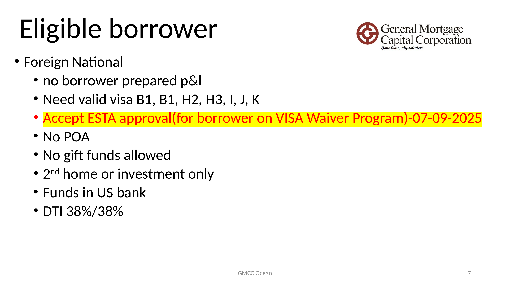

---

## Slide 8

# Transactions

Purchase – ok

R/T-		One borrower must be on title at time of application
		 List for sales must be withdrawn PRIOR to application
		Use appraised value regardless the purchase date.

Cash Out – 	Current mortgage to be paid off must have 12 months seasoning
		One borrower must be on title for 6 months (prior to closing)
		List for sales must be withdrawn PRIOR to application

Delayed financing -	property purchased within 6 months
			priced as cash out

GMCC Ocean

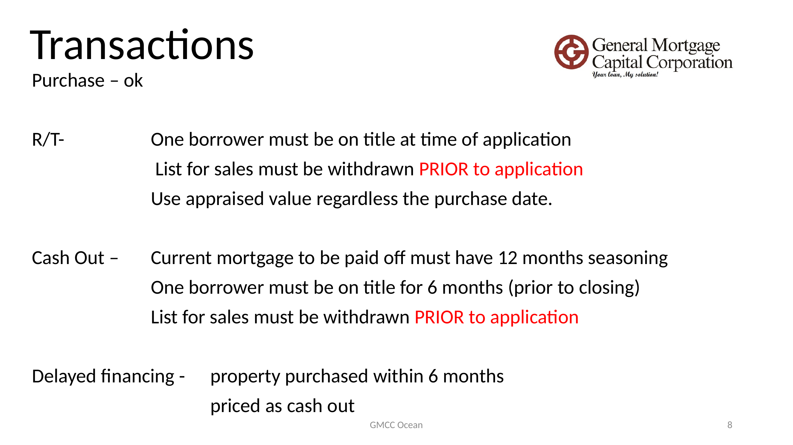

---

## Slide 9

# DTI

Max DTI 38/43%, Foreign National – 38/38%

Purchase, R/T or cash out – same DTI requirement

GMCC Ocean

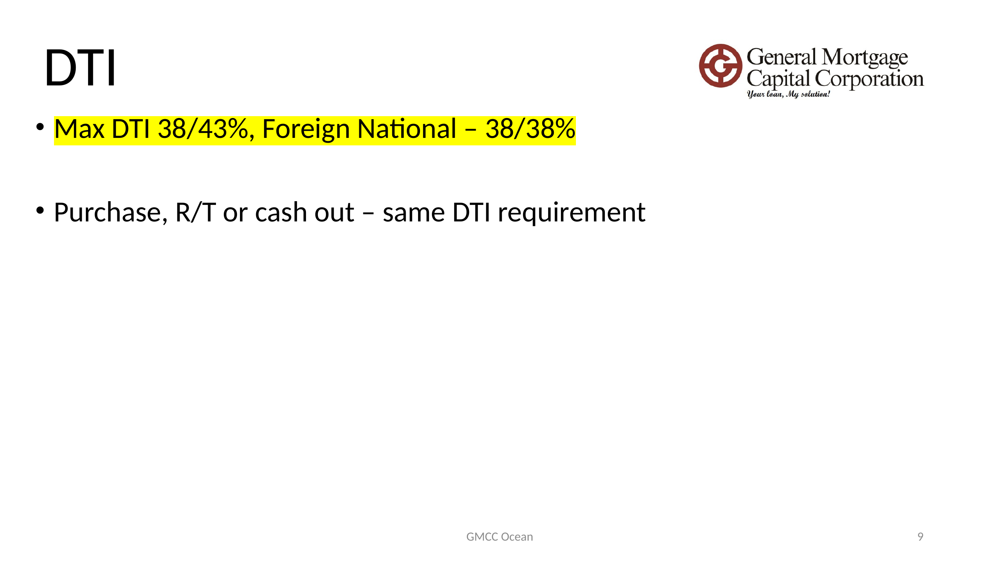

---

## Slide 10

# Income

Wage earner

WVOE (Fannie Mae form) signed by HR, Accounting or owner. Income should be inline with position.
WVOE must contain: Dates of employment, Position, Prospect of continue employment, based pay amount and frequency.

requires two years of work history at the same place of employment or in a similar field.

GMCC Ocean

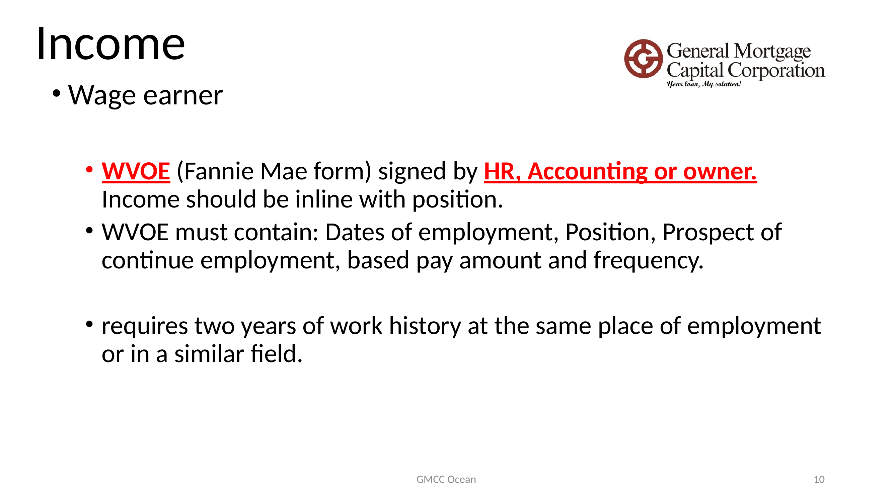

---

## Slide 11

# Income

Self Employed
Option 1: 	Borrower prepared P&L
	Need CPA letter for ownership %
	Need CPA letter if using business funds
	Need 2 years Business License
	CPA needs to say they had filed the business tax returns for the last 2 years

Option 2 (For borrower has no business license)   CPA prepared P&L
	Need CPA letter for ownership %
	Need CPA letter if using business funds
	CPA needs to say they had filed the business tax returns for the last 2 years
	Need LOE to explain business nature

GMCC Ocean

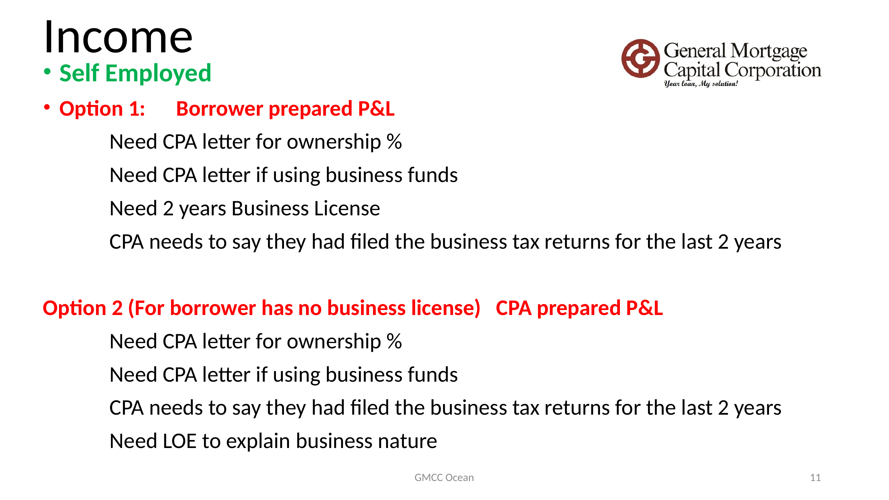

---

## Slide 12

# Income

Self Employed –
P&L prepared by tax preparer (CPA, EA, CTEC, PTIN) or by borrower.
Application date before 7/1 – need YTD and last year (12 mos) P&L
Application date after 6/30 – need YTD P&L
P&L must be dated as MM/DD/YYYY – MM/DD/YYYY
Tax preparer letter (on formal letter head) confirming
filed borrower’s last 2 years business tax returns
Confirm borrower has been in business for 2 years or more at the same location(must disclose company name and address)
Confirm borrower’s business ownership %
Tax preparer license may be verified
		AND
2 Years of current business license if using borrower prepared P&L.
Acceptable business license: a: Professional license, e.g. Real Estate License, Cosmetologist license, Insurance license, Massage therapist license, etc; b: City business license.

GMCC Ocean

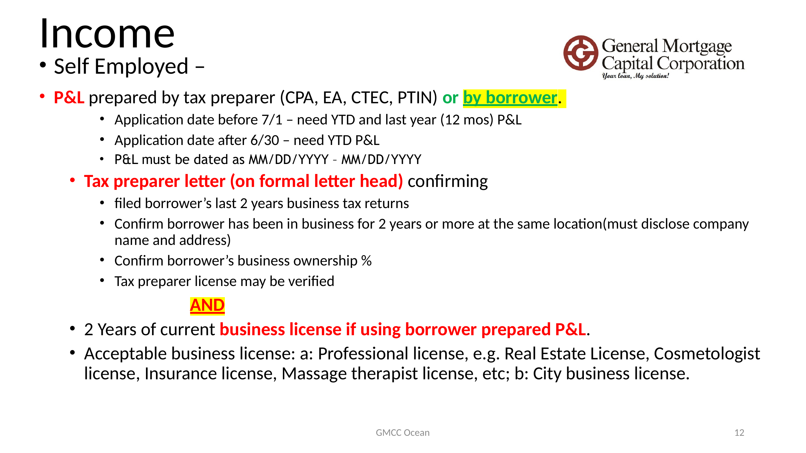

---

## Slide 13

# Income

Rental income

Investment Purchase – need rent survey + lease agreement ( if vacant, only 1007 is needed)
Use 75%
Short term rental – not allowed
Using rental for REOs – use 75% of lease agreement
Using departure rental:
Use 75% of lease agreement
Need copy of security deposit check
Need additional 3 months reserve (based on departing PITIA)

GMCC Ocean

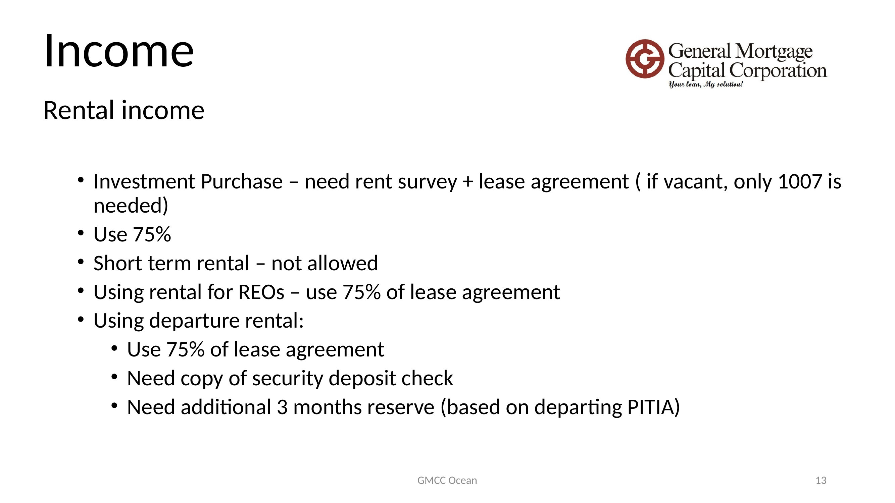

---

## Slide 14

# Credit

Min FICO 680 (must have 3 FICO)
2 tradelines with 12 months seasoning
0x30 on VOR or VOM
Bankruptcy/Foreclosures – 4 years
Short sales – 2 years
Non-traditional credit is allowed if not enough tradelines

GMCC Ocean

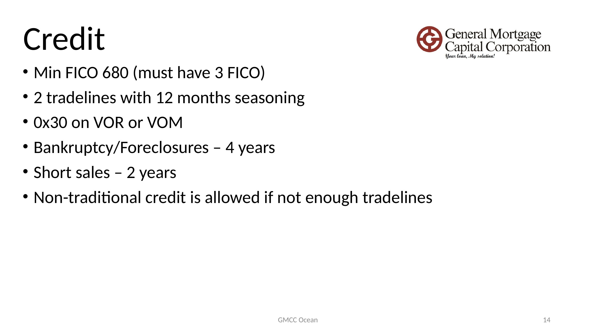

---

## Slide 15

# Assets

1 month of bank statement or VOD (VOD preferred).
100% Gift funds for down payment and cash to close is ok for primary and 2nd home.
Gift funds NOT allowed on Investment purchase.
Gift funds not allowed for Foreign National Borrower.
Gift funds cannot be for reserve.
Large deposit – 50% of monthly income
Stock & bond – value at 70%;
Retirement – value at 70%
Cash out proceeds can be used as reserve

GMCC Ocean

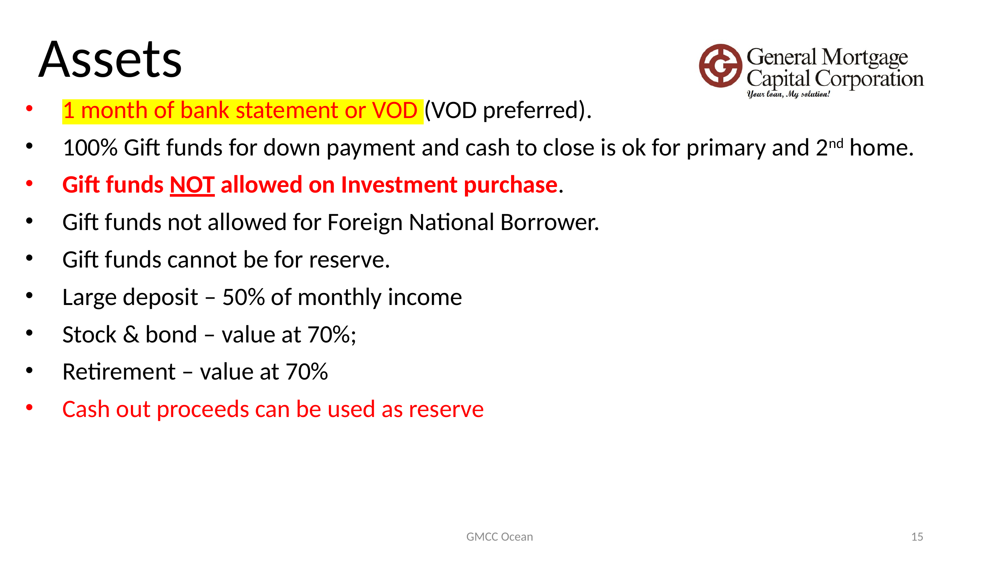

---

## Slide 16

# Reserve – Alt Doc

Reserve required as follows:
Primary: 3 months (PITIA reserve by qual rate)

Second/Investment: 6 months (PITIA reserve by qual rate)

Departing home (converted to 2nd home or investment):- need 6 months reserve (both subject and departing) if departing is less than 20% equity.
	- need 2 months reserve (both subject and departing) if departing is more than 20% equity.

GMCC Ocean

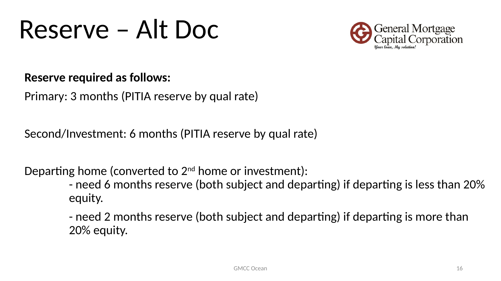

---

## Slide 17

# Liabilities

Student loan – amount on credit report or 1%
Co-signing liability – can be excluded if showing 6 months payments from other party
HELOC – actual payment
Alimony – deduct from income
Installment – less then 10 payments – do not count

GMCC Ocean

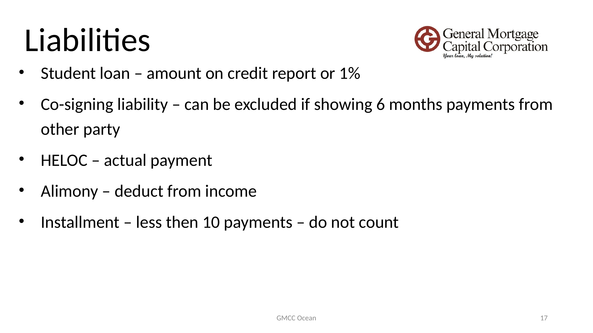

---

## Slide 18

# Appraisal

Loan amount<=$1.5M: 1 Appraisal + desk review
Loan amount>$1.5M:   2 Appraisal report

> Max # of financed properties
Primary, 2nd – no limit
Investment – 10 financed properties

**The financed property limit applies to the borrower’s ownership of 1-4 units financed properties **

No 4 units + ADU

GMCC Ocean

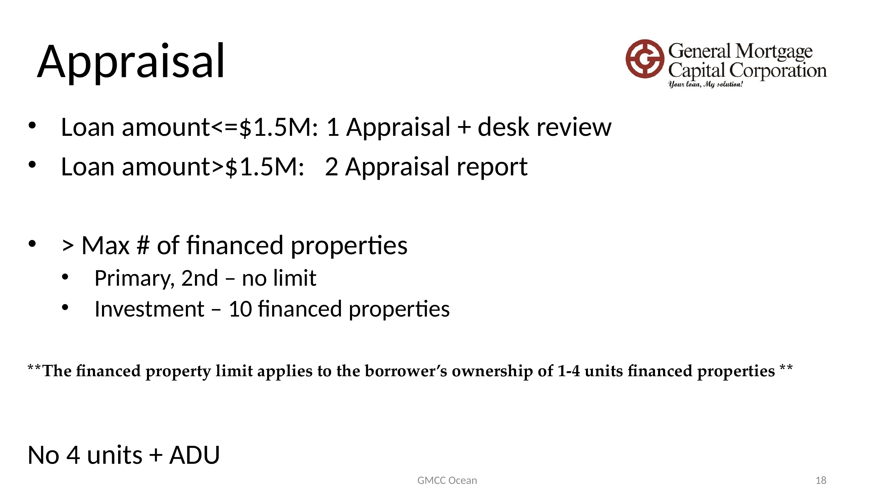

---

## Slide 19

# Business license

Must show at least 2 years + current
Current business license that does not have start date – not useful since cannot prove 2 years in business

GMCC Ocean

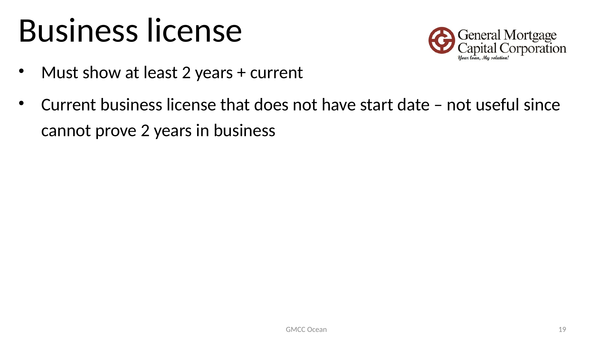

---

## Slide 20

# Example

GMCC Ocean

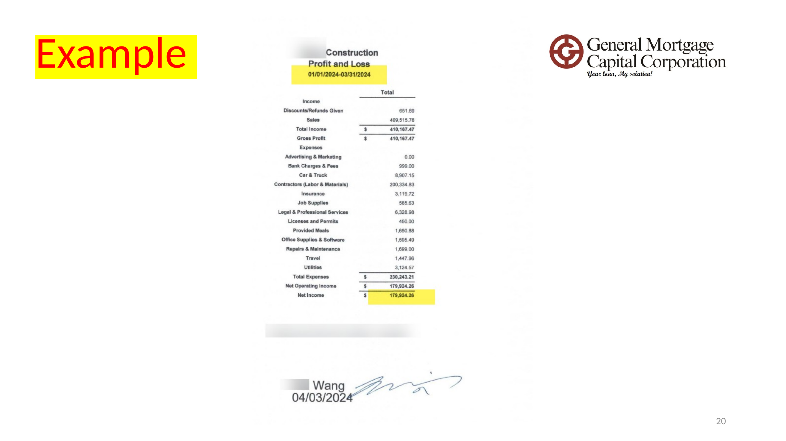

---

## Slide 21

# Example

GMCC Ocean

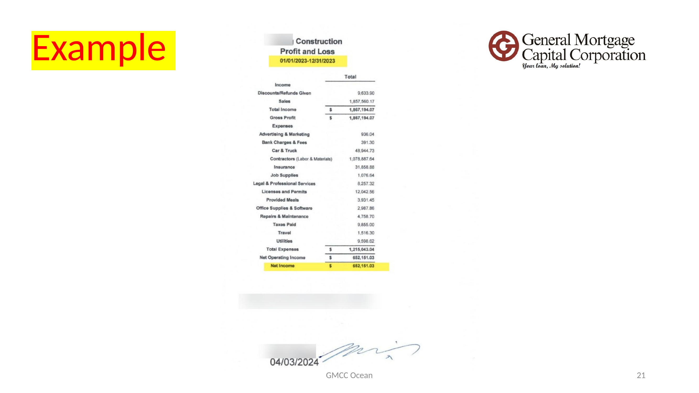

---

## Slide 22

# Example

GMCC Ocean

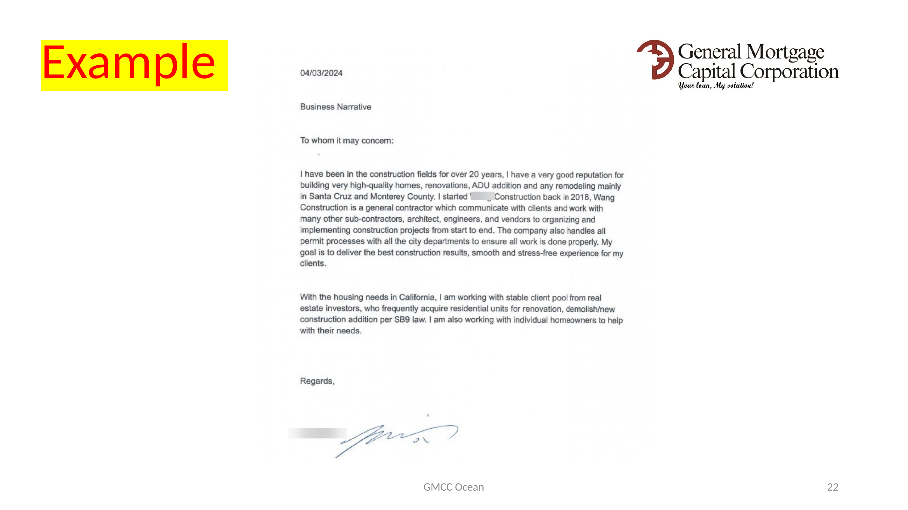

---

## Slide 23

# Example

GMCC Ocean

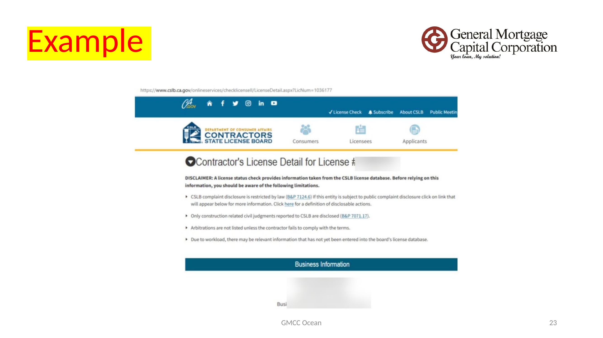

---

## Slide 24

# Example

GMCC Ocean

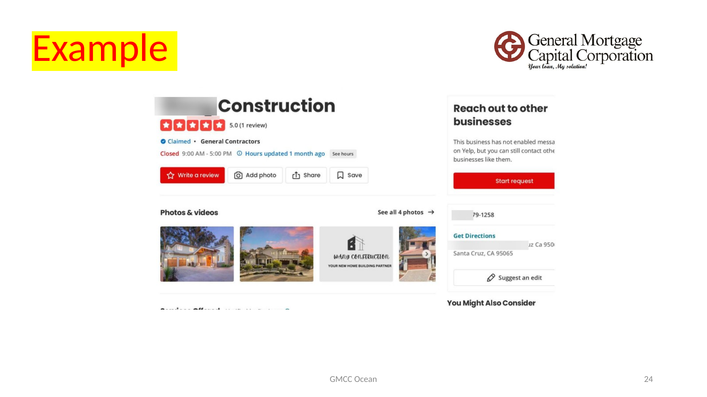

---

## Slide 25

# Example

GMCC Ocean

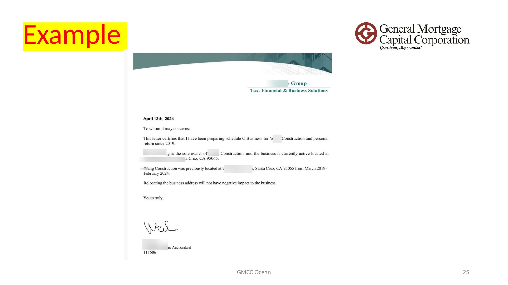

---

