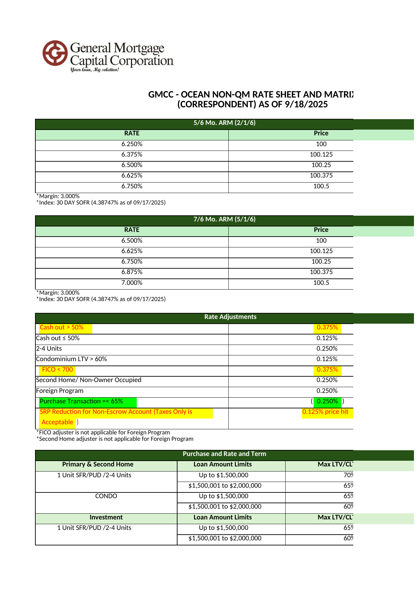
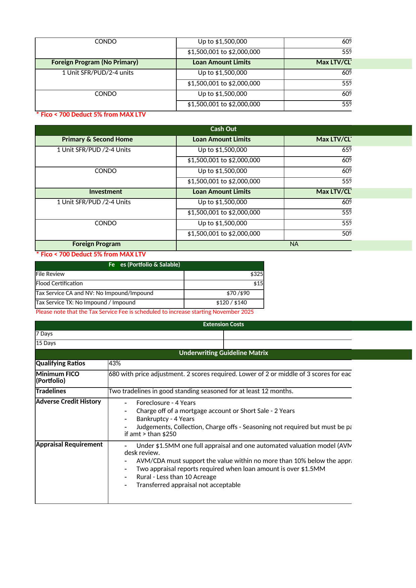
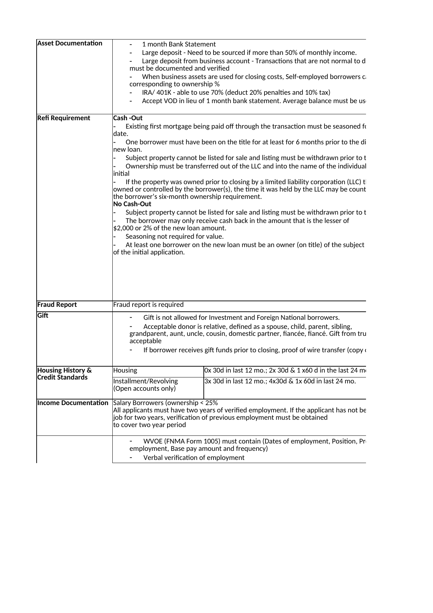
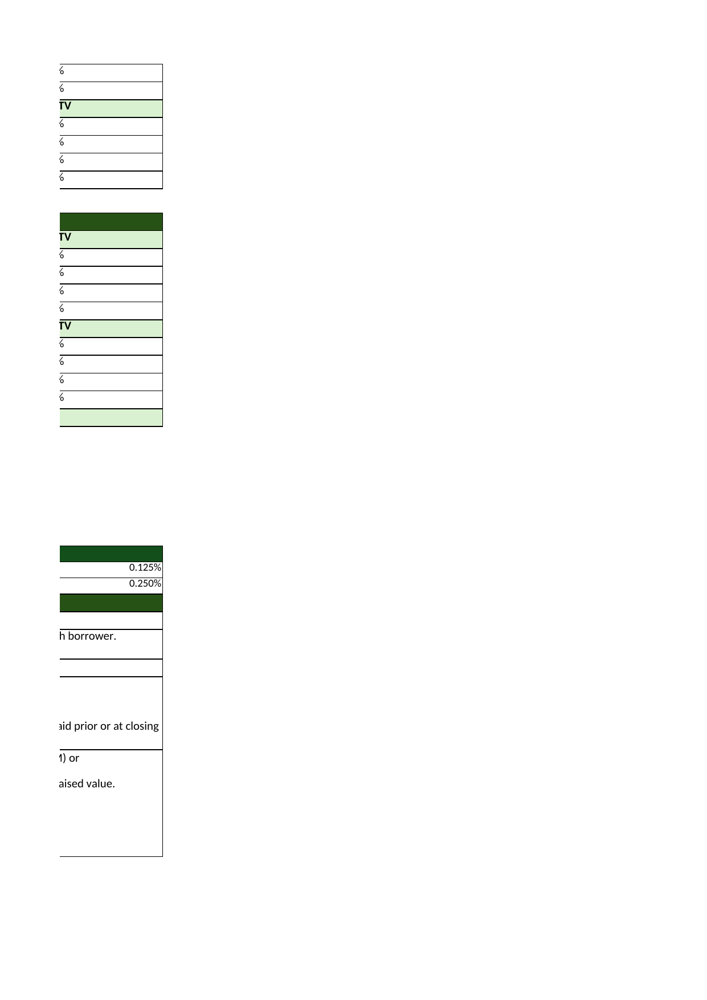
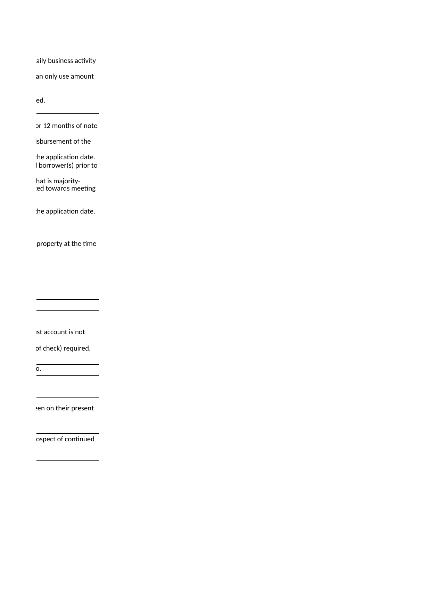
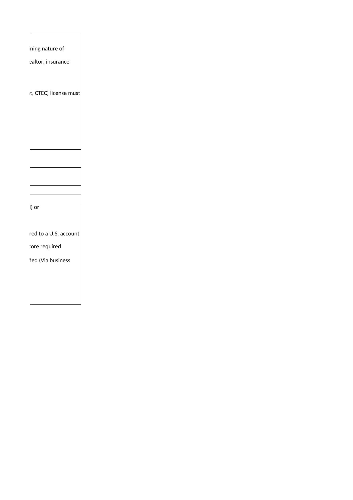

# Excel: GMCC Ocean Rate Sheet 9.18.2025.xlsx

## Table 1
| Unnamed: 0 | Unnamed: 1 | Unnamed: 2 | Unnamed: 3 | Unnamed: 4 | Unnamed: 5 | Unnamed: 6 | Unnamed: 7 | Unnamed: 8 | Unnamed: 9 | Unnamed: 10 | Unnamed: 11 | Unnamed: 12 | Unnamed: 13 | Unnamed: 14 | Unnamed: 15 | Unnamed: 16 | Unnamed: 17 | Unnamed: 18 |
| --- | --- | --- | --- | --- | --- | --- | --- | --- | --- | --- | --- | --- | --- | --- | --- | --- | --- | --- |
| GMCC - OCEAN NON-QM RATE SHEET AND MATRIX\n(CORRESPONDENT) AS OF 9/18/2025 | NaN | NaN | NaN | NaN | NaN | NaN | NaN | NaN | NaN | NaN | NaN | NaN | NaN | NaN | NaN | NaN | NaN | NaN |
| 5/6 Mo. ARM (2/1/6) | NaN | NaN | NaN | NaN | NaN | NaN | NaN | NaN | NaN | NaN | NaN | NaN | NaN | NaN | NaN | NaN | NaN | NaN |
| RATE | NaN | NaN | NaN | NaN | NaN | NaN | NaN | NaN | NaN | NaN | NaN | NaN | Price | NaN | NaN | NaN | NaN | NaN |
| 0.0625 | NaN | NaN | NaN | NaN | NaN | NaN | NaN | NaN | NaN | NaN | NaN | NaN | 100 | NaN | NaN | NaN | NaN | NaN |
| 0.06375 | NaN | NaN | NaN | NaN | NaN | NaN | NaN | NaN | NaN | NaN | NaN | NaN | 100.125 | NaN | NaN | NaN | NaN | NaN |
| 0.065 | NaN | NaN | NaN | NaN | NaN | NaN | NaN | NaN | NaN | NaN | NaN | NaN | 100.25 | NaN | NaN | NaN | NaN | NaN |
| 0.06625 | NaN | NaN | NaN | NaN | NaN | NaN | NaN | NaN | NaN | NaN | NaN | NaN | 100.375 | NaN | NaN | NaN | NaN | NaN |
| 0.0675 | NaN | NaN | NaN | NaN | NaN | NaN | NaN | NaN | NaN | NaN | NaN | NaN | 100.5 | NaN | NaN | NaN | NaN | NaN |
| \*Margin: 3.000%\n\*Index: 30 DAY SOFR (4.38747% as of 09/17/2025) | NaN | NaN | NaN | NaN | NaN | NaN | NaN | NaN | NaN | NaN | NaN | NaN | NaN | NaN | NaN | NaN | NaN | NaN |
| 7/6 Mo. ARM (5/1/6) | NaN | NaN | NaN | NaN | NaN | NaN | NaN | NaN | NaN | NaN | NaN | NaN | NaN | NaN | NaN | NaN | NaN | NaN |
| RATE | NaN | NaN | NaN | NaN | NaN | NaN | NaN | NaN | NaN | NaN | NaN | NaN | Price | NaN | NaN | NaN | NaN | NaN |
| 0.065 | NaN | NaN | NaN | NaN | NaN | NaN | NaN | NaN | NaN | NaN | NaN | NaN | 100 | NaN | NaN | NaN | NaN | NaN |
| 0.06625 | NaN | NaN | NaN | NaN | NaN | NaN | NaN | NaN | NaN | NaN | NaN | NaN | 100.125 | NaN | NaN | NaN | NaN | NaN |
| 0.0675 | NaN | NaN | NaN | NaN | NaN | NaN | NaN | NaN | NaN | NaN | NaN | NaN | 100.25 | NaN | NaN | NaN | NaN | NaN |
| 0.06875 | NaN | NaN | NaN | NaN | NaN | NaN | NaN | NaN | NaN | NaN | NaN | NaN | 100.375 | NaN | NaN | NaN | NaN | NaN |
| 0.07 | NaN | NaN | NaN | NaN | NaN | NaN | NaN | NaN | NaN | NaN | NaN | NaN | 100.5 | NaN | NaN | NaN | NaN | NaN |
| \*Margin: 3.000%\n\*Index: 30 DAY SOFR (4.38747% as of 09/17/2025) | NaN | NaN | NaN | NaN | NaN | NaN | NaN | NaN | NaN | NaN | NaN | NaN | NaN | NaN | NaN | NaN | NaN | NaN |
| Rate Adjustments | NaN | NaN | NaN | NaN | NaN | NaN | NaN | NaN | NaN | NaN | NaN | NaN | NaN | NaN | NaN | NaN | NaN | NaN |
| NaN | Cash out > 50% | NaN | NaN | NaN | NaN | NaN | NaN | NaN | NaN | NaN | NaN | NaN | NaN | NaN | NaN | NaN | 0.00375 | NaN |
| Cash out ≤ 50% | NaN | NaN | NaN | NaN | NaN | NaN | NaN | NaN | NaN | NaN | NaN | NaN | 0.00125 | NaN | NaN | NaN | NaN | NaN |
| 2-4 Units | NaN | NaN | NaN | NaN | NaN | NaN | NaN | NaN | NaN | NaN | NaN | NaN | 0.0025 | NaN | NaN | NaN | NaN | NaN |
| Condominium LTV > 60% | NaN | NaN | NaN | NaN | NaN | NaN | NaN | NaN | NaN | NaN | NaN | NaN | 0.00125 | NaN | NaN | NaN | NaN | NaN |
| NaN | FICO < 700 | NaN | NaN | NaN | NaN | NaN | NaN | NaN | NaN | NaN | NaN | NaN | NaN | NaN | NaN | NaN | 0.00375 | NaN |
| Second Home/ Non-Owner Occupied | NaN | NaN | NaN | NaN | NaN | NaN | NaN | NaN | NaN | NaN | NaN | NaN | 0.0025 | NaN | NaN | NaN | NaN | NaN |
| Foreign Program | NaN | NaN | NaN | NaN | NaN | NaN | NaN | NaN | NaN | NaN | NaN | NaN | 0.0025 | NaN | NaN | NaN | NaN | NaN |
| NaN | Purchase Transaction =< 65% | NaN | NaN | NaN | NaN | NaN | NaN | NaN | NaN | NaN | NaN | NaN | ( | NaN | NaN | NaN | 0.00250 | ) |
| NaN | SRP Reduction for Non-Escrow Account (Taxes Only is | NaN | NaN | NaN | NaN | NaN | NaN | NaN | NaN | NaN | NaN | NaN | NaN | NaN | NaN | 0.125% price hit | NaN | NaN |
| NaN | Acceptable | ) | NaN | NaN | NaN | NaN | NaN | NaN | NaN | NaN | NaN | NaN | NaN | NaN | NaN | NaN | NaN | NaN |
| \*FICO adjuster is not applicable for Foreign Program\n\*Second Home adjuster is not applicable for Foreign Program | NaN | NaN | NaN | NaN | NaN | NaN | NaN | NaN | NaN | NaN | NaN | NaN | NaN | NaN | NaN | NaN | NaN | NaN |
| Purchase and Rate and Term | NaN | NaN | NaN | NaN | NaN | NaN | NaN | NaN | NaN | NaN | NaN | NaN | NaN | NaN | NaN | NaN | NaN | NaN |
| Primary & Second Home | NaN | NaN | NaN | NaN | NaN | NaN | Loan Amount Limits | NaN | NaN | NaN | NaN | NaN | NaN | NaN | Max LTV/CLTV | NaN | NaN | NaN |
| 1 Unit SFR/PUD /2-4 Units | NaN | NaN | NaN | NaN | NaN | NaN | Up to $1,500,000 | NaN | NaN | NaN | NaN | NaN | NaN | NaN | 0.7 | NaN | NaN | NaN |
| NaN | NaN | NaN | NaN | NaN | NaN | NaN | $1,500,001 to $2,000,000 | NaN | NaN | NaN | NaN | NaN | NaN | NaN | 0.65 | NaN | NaN | NaN |
| CONDO | NaN | NaN | NaN | NaN | NaN | NaN | Up to $1,500,000 | NaN | NaN | NaN | NaN | NaN | NaN | NaN | 0.65 | NaN | NaN | NaN |
| NaN | NaN | NaN | NaN | NaN | NaN | NaN | $1,500,001 to $2,000,000 | NaN | NaN | NaN | NaN | NaN | NaN | NaN | 0.6 | NaN | NaN | NaN |
| Investment | NaN | NaN | NaN | NaN | NaN | NaN | Loan Amount Limits | NaN | NaN | NaN | NaN | NaN | NaN | NaN | Max LTV/CLTV | NaN | NaN | NaN |
| 1 Unit SFR/PUD /2-4 Units | NaN | NaN | NaN | NaN | NaN | NaN | Up to $1,500,000 | NaN | NaN | NaN | NaN | NaN | NaN | NaN | 0.65 | NaN | NaN | NaN |
| NaN | NaN | NaN | NaN | NaN | NaN | NaN | $1,500,001 to $2,000,000 | NaN | NaN | NaN | NaN | NaN | NaN | NaN | 0.6 | NaN | NaN | NaN |
| CONDO | NaN | NaN | NaN | NaN | NaN | NaN | Up to $1,500,000 | NaN | NaN | NaN | NaN | NaN | NaN | NaN | 0.6 | NaN | NaN | NaN |
| NaN | NaN | NaN | NaN | NaN | NaN | NaN | $1,500,001 to $2,000,000 | NaN | NaN | NaN | NaN | NaN | NaN | NaN | 0.55 | NaN | NaN | NaN |
| Foreign Program (No Primary) | NaN | NaN | NaN | NaN | NaN | NaN | Loan Amount Limits | NaN | NaN | NaN | NaN | NaN | NaN | NaN | Max LTV/CLTV | NaN | NaN | NaN |
| 1 Unit SFR/PUD/2-4 units | NaN | NaN | NaN | NaN | NaN | NaN | Up to $1,500,000 | NaN | NaN | NaN | NaN | NaN | NaN | NaN | 0.6 | NaN | NaN | NaN |
| NaN | NaN | NaN | NaN | NaN | NaN | NaN | $1,500,001 to $2,000,000 | NaN | NaN | NaN | NaN | NaN | NaN | NaN | 0.55 | NaN | NaN | NaN |
| CONDO | NaN | NaN | NaN | NaN | NaN | NaN | Up to $1,500,000 | NaN | NaN | NaN | NaN | NaN | NaN | NaN | 0.6 | NaN | NaN | NaN |
| NaN | NaN | NaN | NaN | NaN | NaN | NaN | $1,500,001 to $2,000,000 | NaN | NaN | NaN | NaN | NaN | NaN | NaN | 0.55 | NaN | NaN | NaN |
| \* Fico < 700 Deduct 5% from MAX LTV | NaN | NaN | NaN | NaN | NaN | NaN | NaN | NaN | NaN | NaN | NaN | NaN | NaN | NaN | NaN | NaN | NaN | NaN |
| Cash Out | NaN | NaN | NaN | NaN | NaN | NaN | NaN | NaN | NaN | NaN | NaN | NaN | NaN | NaN | NaN | NaN | NaN | NaN |
| Primary & Second Home | NaN | NaN | NaN | NaN | NaN | NaN | Loan Amount Limits | NaN | NaN | NaN | NaN | NaN | NaN | NaN | Max LTV/CLTV | NaN | NaN | NaN |
| 1 Unit SFR/PUD /2-4 Units | NaN | NaN | NaN | NaN | NaN | NaN | Up to $1,500,000 | NaN | NaN | NaN | NaN | NaN | NaN | NaN | 0.65 | NaN | NaN | NaN |
| NaN | NaN | NaN | NaN | NaN | NaN | NaN | $1,500,001 to $2,000,000 | NaN | NaN | NaN | NaN | NaN | NaN | NaN | 0.6 | NaN | NaN | NaN |
| CONDO | NaN | NaN | NaN | NaN | NaN | NaN | Up to $1,500,000 | NaN | NaN | NaN | NaN | NaN | NaN | NaN | 0.6 | NaN | NaN | NaN |
| NaN | NaN | NaN | NaN | NaN | NaN | NaN | $1,500,001 to $2,000,000 | NaN | NaN | NaN | NaN | NaN | NaN | NaN | 0.55 | NaN | NaN | NaN |
| Investment | NaN | NaN | NaN | NaN | NaN | NaN | Loan Amount Limits | NaN | NaN | NaN | NaN | NaN | NaN | NaN | Max LTV/CLTV | NaN | NaN | NaN |
| 1 Unit SFR/PUD /2-4 Units | NaN | NaN | NaN | NaN | NaN | NaN | Up to $1,500,000 | NaN | NaN | NaN | NaN | NaN | NaN | NaN | 0.6 | NaN | NaN | NaN |
| NaN | NaN | NaN | NaN | NaN | NaN | NaN | $1,500,001 to $2,000,000 | NaN | NaN | NaN | NaN | NaN | NaN | NaN | 0.55 | NaN | NaN | NaN |
| CONDO | NaN | NaN | NaN | NaN | NaN | NaN | Up to $1,500,000 | NaN | NaN | NaN | NaN | NaN | NaN | NaN | 0.55 | NaN | NaN | NaN |
| NaN | NaN | NaN | NaN | NaN | NaN | NaN | $1,500,001 to $2,000,000 | NaN | NaN | NaN | NaN | NaN | NaN | NaN | 0.5 | NaN | NaN | NaN |
| Foreign Program | NaN | NaN | NaN | NaN | NaN | NaN | NaN | NaN | NaN | NaN | NaN | NaN | NaN | NaN | NaN | NaN | NaN | NaN |
| \* Fico < 700 Deduct 5% from MAX LTV | NaN | NaN | NaN | NaN | NaN | NaN | NaN | NaN | NaN | NaN | NaN | NaN | NaN | NaN | NaN | NaN | NaN | NaN |
| NaN | NaN | NaN | NaN | Fe | es (Portfolio & Salable) | NaN | NaN | NaN | NaN | NaN | NaN | NaN | NaN | NaN | NaN | NaN | NaN | NaN |
| File Review | NaN | NaN | NaN | NaN | NaN | NaN | NaN | 325 | NaN | NaN | NaN | NaN | NaN | NaN | NaN | NaN | NaN | NaN |
| Flood Certification | NaN | NaN | NaN | NaN | NaN | NaN | NaN | 15 | NaN | NaN | NaN | NaN | NaN | NaN | NaN | NaN | NaN | NaN |
| Tax Service CA and NV: No Impound/Impound | NaN | NaN | NaN | NaN | NaN | NaN | NaN | $70 /$90 | NaN | NaN | NaN | NaN | NaN | NaN | NaN | NaN | NaN | NaN |
| Tax Service TX: No Impound / Impound | NaN | NaN | NaN | NaN | NaN | NaN | NaN | $120 / $140 | NaN | NaN | NaN | NaN | NaN | NaN | NaN | NaN | NaN | NaN |
| Please note that the Tax Service Fee is scheduled to increase starting November 2025 | NaN | NaN | NaN | NaN | NaN | NaN | NaN | NaN | NaN | NaN | NaN | NaN | NaN | NaN | NaN | NaN | NaN | NaN |
| Extension Costs | NaN | NaN | NaN | NaN | NaN | NaN | NaN | NaN | NaN | NaN | NaN | NaN | NaN | NaN | NaN | NaN | NaN | NaN |
| 7 Days | NaN | NaN | NaN | NaN | NaN | NaN | NaN | NaN | NaN | NaN | NaN | 0.00125 | NaN | NaN | NaN | NaN | NaN | NaN |
| 15 Days | NaN | NaN | NaN | NaN | NaN | NaN | NaN | NaN | NaN | NaN | NaN | 0.00250 | NaN | NaN | NaN | NaN | NaN | NaN |
| Underwriting Guideline Matrix | NaN | NaN | NaN | NaN | NaN | NaN | NaN | NaN | NaN | NaN | NaN | NaN | NaN | NaN | NaN | NaN | NaN | NaN |
| Qualifying Ratios | NaN | NaN | NaN | 0.43 | NaN | NaN | NaN | NaN | NaN | NaN | NaN | NaN | NaN | NaN | NaN | NaN | NaN | NaN |
| Minimum FICO (Portfolio) | NaN | NaN | NaN | 680 with price adjustment. 2 scores required. Lower of 2 or middle of 3 scores for each borrower. | NaN | NaN | NaN | NaN | NaN | NaN | NaN | NaN | NaN | NaN | NaN | NaN | NaN | NaN |
| Tradelines | NaN | NaN | NaN | Two tradelines in good standing seasoned for at least 12 months. | NaN | NaN | NaN | NaN | NaN | NaN | NaN | NaN | NaN | NaN | NaN | NaN | NaN | NaN |
| Adverse Credit History | NaN | NaN | NaN | - Foreclosure - 4 Years\n- Charge off of a mortgage account or Short Sale - 2 Years\n- Bankruptcy - 4 Years\n- Judgements, Collection, Charge offs - Seasoning not required but must be paid prior or at closing if amt > than $250 | NaN | NaN | NaN | NaN | NaN | NaN | NaN | NaN | NaN | NaN | NaN | NaN | NaN | NaN |
| Appraisal Requirement | NaN | NaN | NaN | - Under $1.5MM one full appraisal and one automated valuation model (AVM) or\ndesk review.\n- AVM/CDA must support the value within no more than 10% below the appraised value.\n- Two appraisal reports required when loan amount is over $1.5MM\n- Rural - Less than 10 Acreage\n- Transferred appraisal not acceptable | NaN | NaN | NaN | NaN | NaN | NaN | NaN | NaN | NaN | NaN | NaN | NaN | NaN | NaN |
| Asset Documentation | NaN | NaN | NaN | - 1 month Bank Statement\n- Large deposit - Need to be sourced if more than 50% of monthly income.\n- Large deposit from business account - Transactions that are not normal to daily business activity must be documented and verified\n- When business assets are used for closing costs, Self-employed borrowers can only use amount corresponding to ownership %\n- IRA/ 401K - able to use 70% (deduct 20% penalties and 10% tax)\n- Accept VOD in lieu of 1 month bank statement. Average balance must be used. | NaN | NaN | NaN | NaN | NaN | NaN | NaN | NaN | NaN | NaN | NaN | NaN | NaN | NaN |
| Refi Requirement | NaN | NaN | NaN | Cash -Out\n- Existing first mortgage being paid off through the transaction must be seasoned for 12 months of note date.\n- One borrower must have been on the title for at least for 6 months prior to the disbursement of the new loan.\n- Subject property cannot be listed for sale and listing must be withdrawn prior to the application date.\n- Ownership must be transferred out of the LLC and into the name of the individual borrower(s) prior to initial\n- If the property was owned prior to closing by a limited liability corporation (LLC) that is majority-owned or controlled by the borrower(s), the time it was held by the LLC may be counted towards meeting the borrower’s six-month ownership requirement.\nNo Cash-Out\n- Subject property cannot be listed for sale and listing must be withdrawn prior to the application date.\n- The borrower may only receive cash back in the amount that is the lesser of\n$2,000 or 2% of the new loan amount.\n- Seasoning not required for value.\n- At least one borrower on the new loan must be an owner (on title) of the subject property at the time of the initial application. | NaN | NaN | NaN | NaN | NaN | NaN | NaN | NaN | NaN | NaN | NaN | NaN | NaN | NaN |
| Fraud Report | NaN | NaN | NaN | Fraud report is required | NaN | NaN | NaN | NaN | NaN | NaN | NaN | NaN | NaN | NaN | NaN | NaN | NaN | NaN |
| Gift | NaN | NaN | NaN | - Gift is not allowed for Investment and Foreign National borrowers.\n- Acceptable donor is relative, defined as a spouse, child, parent, sibling,\ngrandparent, aunt, uncle, cousin, domestic partner, fiancée, fiancé. Gift from trust account is not acceptable\n- If borrower receives gift funds prior to closing, proof of wire transfer (copy of check) required. | NaN | NaN | NaN | NaN | NaN | NaN | NaN | NaN | NaN | NaN | NaN | NaN | NaN | NaN |
| Housing History & Credit Standards | NaN | NaN | NaN | Housing | NaN | NaN | NaN | NaN | NaN | 0x 30d in last 12 mo.; 2x 30d & 1 x60 d in the last 24 mo. | NaN | NaN | NaN | NaN | NaN | NaN | NaN | NaN |
| NaN | NaN | NaN | NaN | Installment/Revolving\n(Open accounts only) | NaN | NaN | NaN | NaN | NaN | 3x 30d in last 12 mo.; 4x30d & 1x 60d in last 24 mo. | NaN | NaN | NaN | NaN | NaN | NaN | NaN | NaN |
| Income Documentation | NaN | NaN | NaN | Salary Borrowers (ownership < 25%\nAll applicants must have two years of verified employment. If the applicant has not been on their present job for two years, verification of previous employment must be obtained\nto cover two year period | NaN | NaN | NaN | NaN | NaN | NaN | NaN | NaN | NaN | NaN | NaN | NaN | NaN | NaN |
| NaN | NaN | NaN | NaN | - WVOE (FNMA Form 1005) must contain (Dates of employment, Position, Prospect of continued employment, Base pay amount and frequency)\n- Verbal verification of employment | NaN | NaN | NaN | NaN | NaN | NaN | NaN | NaN | NaN | NaN | NaN | NaN | NaN | NaN |
| NaN | NaN | NaN | NaN | Self-Employed\n- Two Years Business License + Self-Prepared P & L\n• If the nature of business does not require a business license, borrower LOE explaining nature of business + CPA prepared P & L can be provided in lieu of business license.\n- Schedule C and 1099 SE borrowers can utilize third party verifiable licenses (e.g realtor, insurance agents, broker..etc).\n- Current YTD Profit and Loss Statement (application received on or after 7/1)\n- CPA letter\n• Verifying business ownership in the same line of business over the last two years\n• Prepared by CPA or licensed independent third-party tax preparer (Enrolled Agent, CTEC) license must be verified\n• Business name and address\n• If Business funds are used, "use of funds will not have a negative impact\non the business" verbiage must be included | NaN | NaN | NaN | NaN | NaN | NaN | NaN | NaN | NaN | NaN | NaN | NaN | NaN | NaN |
| Prepayment\nPenalty | NaN | NaN | NaN | No prepayment penalty | NaN | NaN | NaN | NaN | NaN | NaN | NaN | NaN | NaN | NaN | NaN | NaN | NaN | NaN |
| Qualifying Rate | NaN | NaN | NaN | 5/6 ARM & 7/6 ARM - Introductory or fully indexed interest rate (margin + 30-Day\nAverage SOFR index as of the lock date) whichever is higher. | NaN | NaN | NaN | NaN | NaN | NaN | NaN | NaN | NaN | NaN | NaN | NaN | NaN | NaN |
| Reserve | NaN | NaN | NaN | Primary | NaN | NaN | NaN | NaN | 3 months (PITIA reserve by qual rate) | NaN | NaN | NaN | NaN | NaN | NaN | NaN | NaN | NaN |
| NaN | NaN | NaN | NaN | Second/Investment | NaN | NaN | NaN | NaN | 6 months (PITIA reserve by qual rate) | NaN | NaN | NaN | NaN | NaN | NaN | NaN | NaN | NaN |
| Foreign National | NaN | NaN | NaN | - Copy of unexpired passport, valid VISA (Please refer to Underwriting manual) or\nproof of ESTA Approval (for borrowers on VISA Waiver Program)\n- F1 AND F2 type are not allowed\n- Borrower must have U.S. address when applying for loan\n- Foreign assets (downpayment, closing costs, and reserves) must be transferred to a U.S. account prior to approval.\n- Credit Report to be pulled to check if there's any negative history. No Fico score required\n- 12 Months PITIA (1% above note rate for 5/6) and DTI Ratio:38%\n- Self-employed business or Foreign CPA license are to be independently verified (Via business search, Google, government or State issue document)\n- All documents must be translated by a certified translator.\n- Automatic payment to be set up with investor\n- Asset verification (must be in U.S. banking institutions) | NaN | NaN | NaN | NaN | NaN | NaN | NaN | NaN | NaN | NaN | NaN | NaN | NaN | NaN |

---

## 工作表预览

### Sheet 1

### Sheet 2

### Sheet 3

### Sheet 4

### Sheet 5

### Sheet 6

### Sheet 7

### Sheet 8

